# Лабораторная работа №2
Реализация полносвязной нейронной сети для задачи классификации.

Сравнение конфигураций полносвязных нейронных сетей.

# Описание директорий

## log
Здесь лежат файлы .json со статистикой по разным конфигурациям.
Они содержат параметры сети (число слоёв, число нейронов, параметр обучения, размер пачки, число эпох) и статистику 
обучения (время, функцию потерь на тестовом и тренировочном наборе, точность на тестовом и тренировочном наборе)

## models
Здесь лежат файлы .h5 с конфигурацией сетей Keras для их последующей повторной загрузки.

## src
Скрипты для работы с данными и фреймворком.
### datahandler.py
Содержит методы для чтения, обработки, визуализации данных.
### modelhandler.py
Содержит методы для работы с сетью: запуск обучения, сбор статистики, сохранение и загрузка сетей.
### reporthandler.py
Содержит методы для генерации таблиц для отчёта.
### notebook.py
Является точкой входа. Блокнот для проведения экспериментов. Содержит метод для запуска серийного эксперимента с 
возможностью вариации количества скрытых слоёв и числа нейронов на них.

## Численные эксперименты
### Параметры

x_train = (86989, 3072)

y_train = (86989, 43)

x_test = (12630, 3072) 

y_test = (12630, 43)

hidden_layer_activation = ReLu

output_layer_activation = Softmax

loss = CrossEntropy 

optimizer = Adam

learning_rate = 0.001

batch_size = 128

num_epochs = 10

### Результаты
[comment]: # (result_table_start)

|        Model name        | Test accuracy | Test loss | Train accuracy | Train loss | Time_train (s) |
| :----------------------- | :-----------: | :-------: | :------------: | :--------: | :------------: |
| FCNN_128                 |    0.8296     |  1.1413   |     0.9737     |    0.11    |    88.2661     |
| FCNN_256                 |    0.8372     |  1.1796   |     0.9834     |   0.0749   |    156.494     |
| FCNN_512                 |    0.8238     |   1.499   |     0.9703     |   0.1017   |    304.0266    |
| FCNN_768                 |    0.8214     |   1.677   |     0.9585     |   0.155    |    427.9855    |
| FCNN_1024                |    0.8308     |  1.5203   |     0.9676     |   0.1048   |    577.2817    |
| FCNN_1536                |    0.8124     |   2.007   |     0.9417     |   0.2375   |    874.5662    |
| FCNN_2048                |    0.8301     |  1.7861   |     0.972      |   0.1176   |   1169.5461    |
| FCNN_2304                |    0.8145     |  2.3281   |     0.9579     |   0.1947   |   1296.7679    |
| FCNN_768_384             |    0.8199     |  1.7376   |     0.9672     |   0.108    |    484.9401    |
| FCNN_1024_512            |    0.8174     |  1.9054   |     0.9503     |   0.1682   |    667.418     |
| FCNN_1536_768            |    0.8093     |  2.1071   |     0.9529     |   0.1638   |    1058.444    |
| FCNN_2304_768            |     0.804     |  1.8858   |     0.9416     |   0.1936   |   1594.2973    |
| FCNN_768_384_96          |    0.8179     |  1.3722   |     0.9696     |   0.0952   |    488.8518    |
| FCNN_768_384_192         |    0.8002     |  1.5157   |     0.9477     |   0.1717   |    490.1318    |
| FCNN_2048_1024_512_256   |    0.7968     |  1.4845   |     0.9442     |   0.1766   |   1666.0184    |
| FCNN_1536_768_384_192_96 |    0.7874     |  1.3712   |     0.9543     |   0.1568   |   1123.9943    |

[comment]: # (result_table_end)

[comment]: # (graph_table_start)

|                    Accuracy                    |                    Loss                    |
| :--------------------------------------------- | :----------------------------------------- |
| 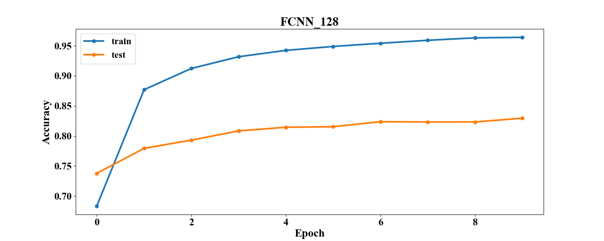                 | 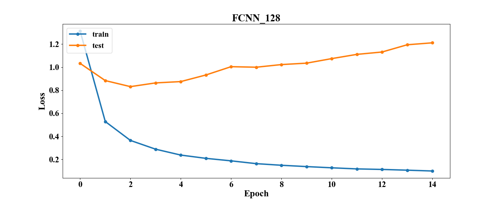                 |
| 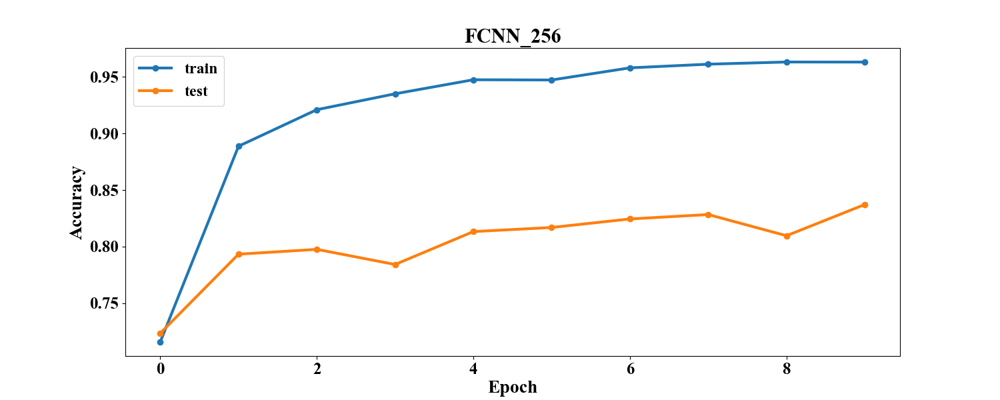                 | 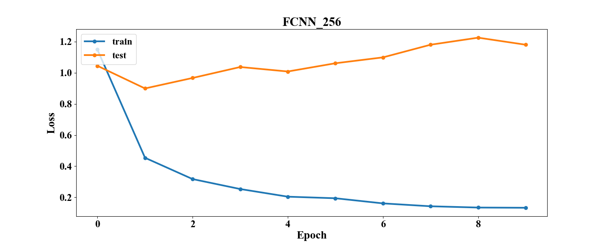                 |
| 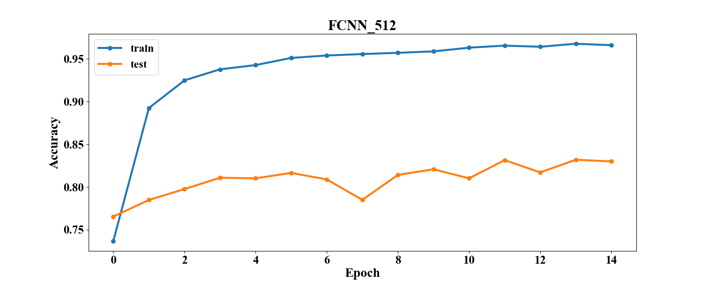                 | 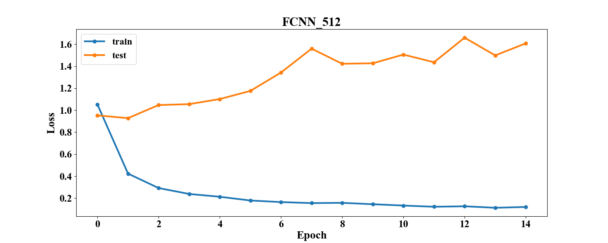                 |
|                  |                  |
| 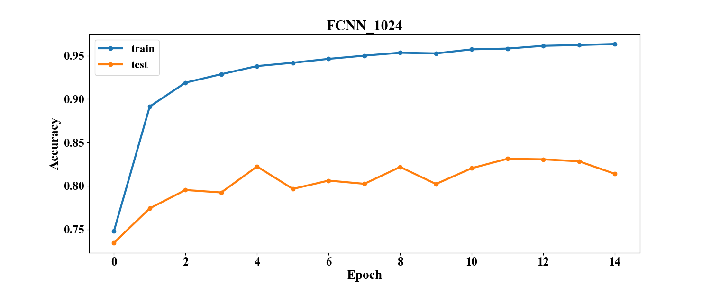                | 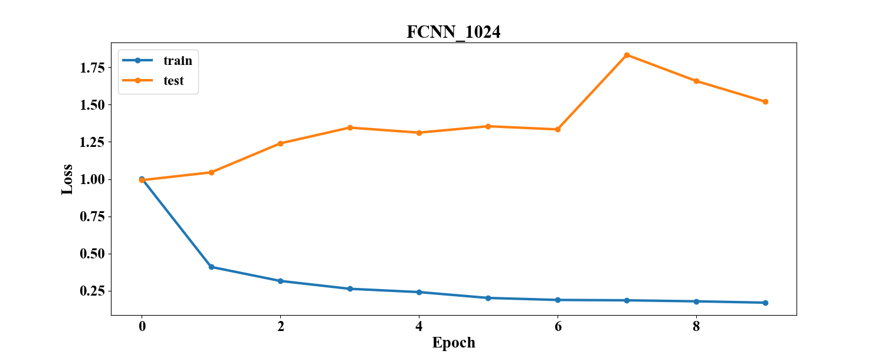                |
|                 |                 |
| 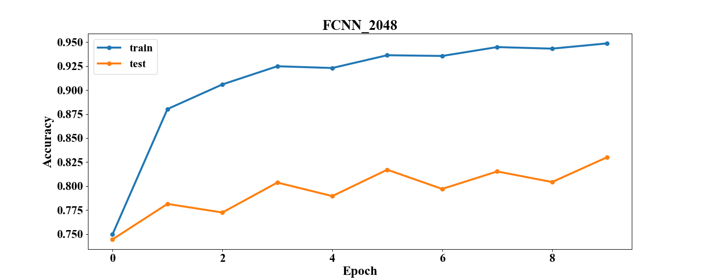                | 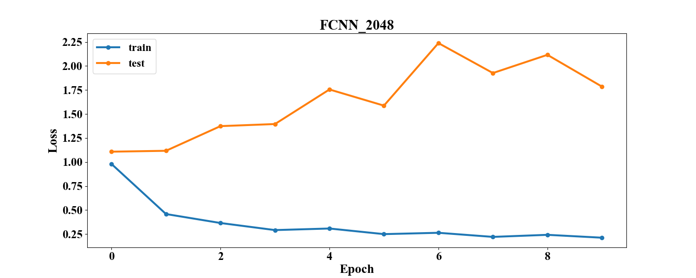                |
|                 |                 |
| 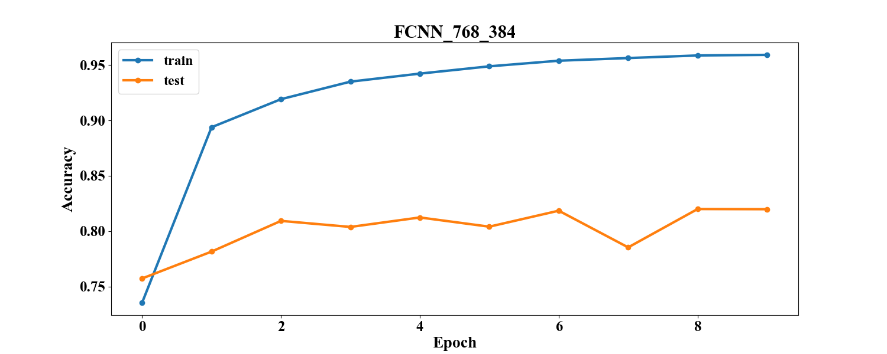             | 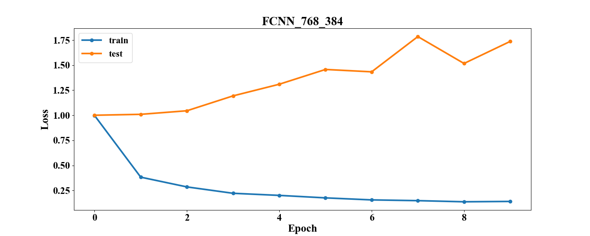             |
| 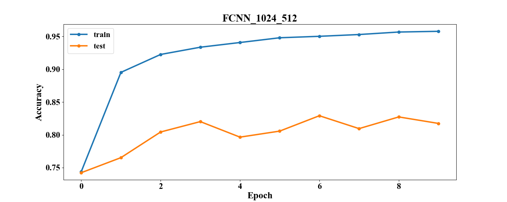            | 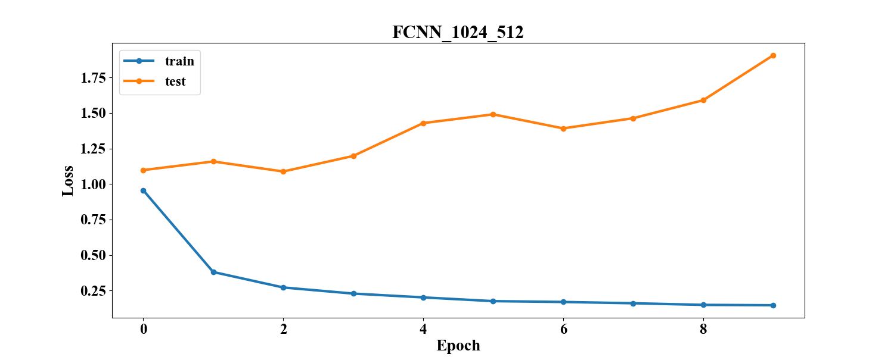            |
|             |             |
|             |             |
| 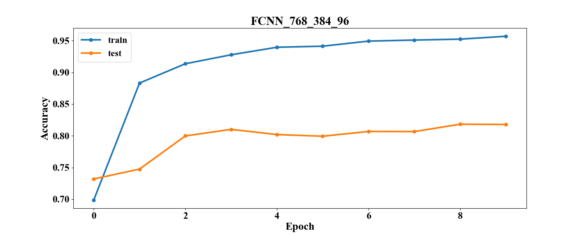          | 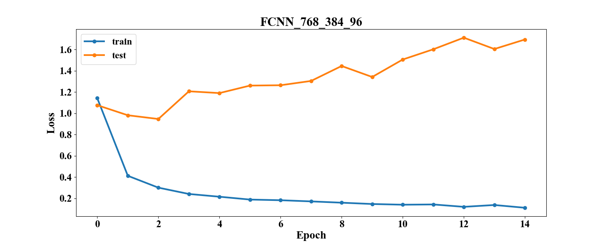          |
| 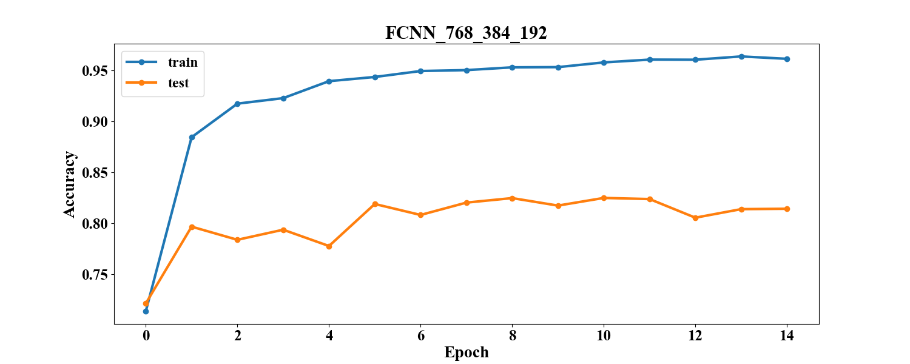         | 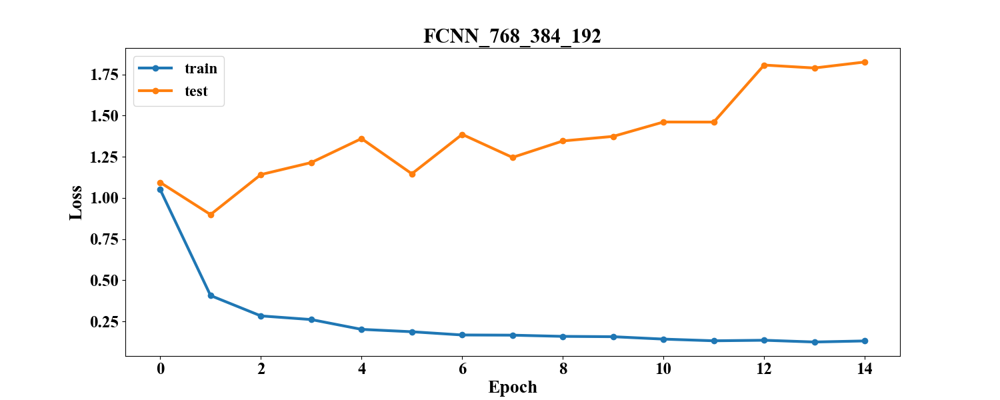         |
| 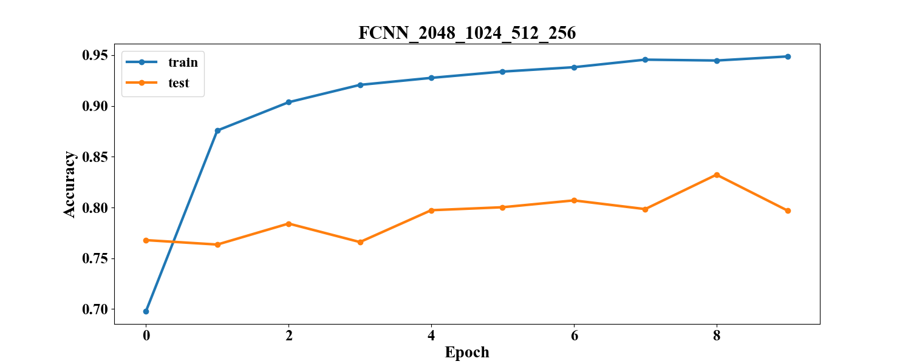   | 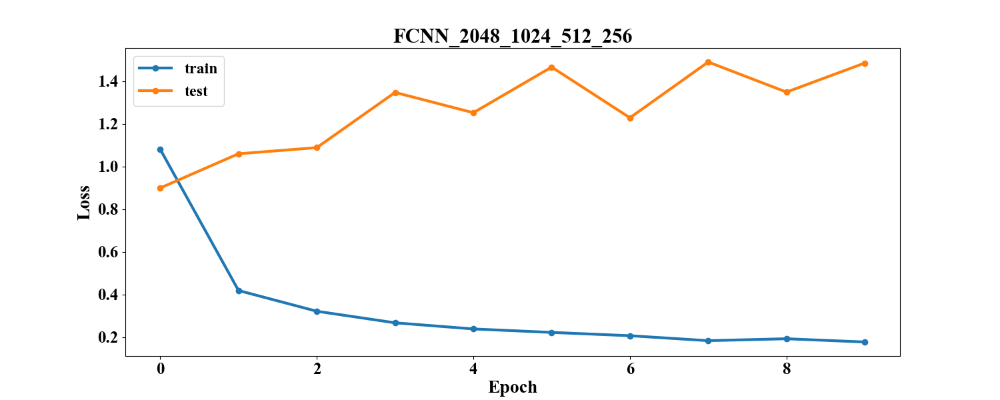   |
|  |  |

[comment]: # (graph_table_end)

### Анализ

