# Лабораторная работа №2
Реализация полносвязной нейронной сети для задачи классификации.

Сравнение конфигураций полносвязных нейронных сетей.

# Описание директорий

## log
Здесь лежат файлы .json со статистикой по разным конфигурациям.
Они содержат параметры сети (число слоёв, число нейронов, параметр обучения, размер пачки, число эпох) и статистику 
обучения (время, функцию потерь на тестовом и тренировочном наборе, точность на тестовом и тренировочном наборе)

## models
Здесь лежат файлы .h5 с конфигурацией сетей Keras для их последующей повторной загрузки.

## src
Скрипты для работы с данными и фреймворком.
### datahandler.py
Содержит методы для чтения, обработки, визуализации данных.
### modelhandler.py
Содержит методы для работы с сетью: запуск обучения, сбор статистики, сохранение и загрузка сетей.
### notebook.py
Является точкой входа. Блокнот для проведения экспериментов. Содержит метод для запуска серийного эксперимента с 
возможностью вариации количества скрытых слоёв и числа нейронов на них.

## Численные эксперименты
### Параметры
### Результаты
[comment]: # (table_start)

|        Model name        | Test accuracy | Test loss | Train accuracy | Train loss | Time_train (s) |
| :----------------------- | :-----------: | :-------: | :------------: | :--------: | :------------: |
| FCNN_768                 |    0.8214     |   1.677   |     0.9585     |   0.155    |    427.9855    |
| FCNN_1536                |    0.8124     |   2.007   |     0.9417     |   0.2375   |    874.5662    |
| FCNN_2304                |    0.8145     |  2.3281   |     0.9579     |   0.1947   |   1296.7679    |
| FCNN_1536_768            |    0.8093     |  2.1071   |     0.9529     |   0.1638   |    1058.444    |
| FCNN_2304_768            |     0.804     |  1.8858   |     0.9416     |   0.1936   |   1594.2973    |
| FCNN_1536_768_384_192_96 |    0.7986     |   1.241   |     0.9395     |   0.208    |   1114.9127    |

[comment]: # (table_end)

[comment]: # (graph_table_start)

|                    Accuracy                    |                    Loss                    |
| :--------------------------------------------- | :----------------------------------------- |
| 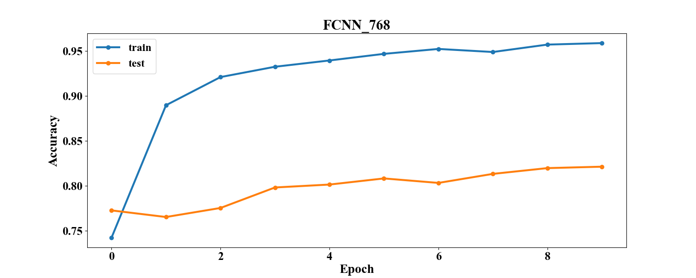                 | 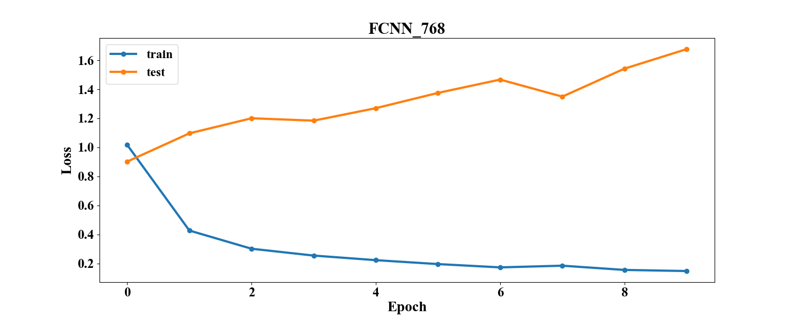                 |
| 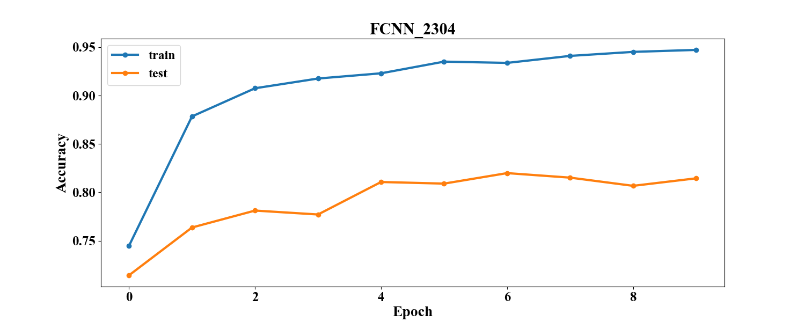                | 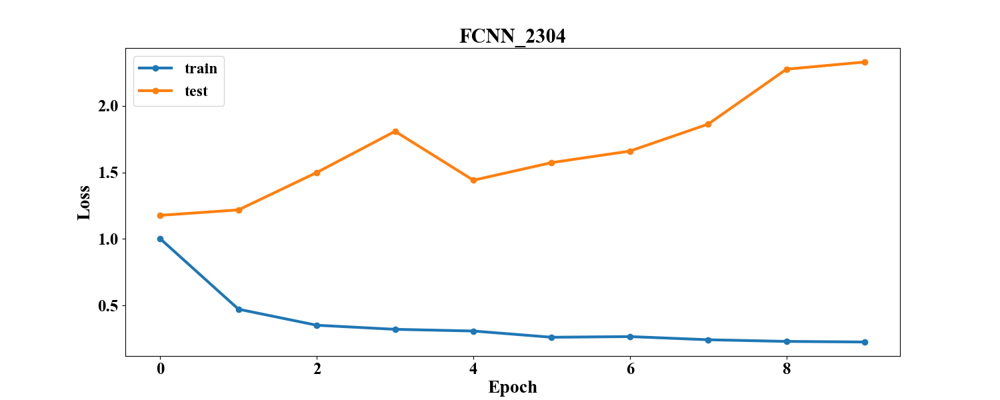                |
| 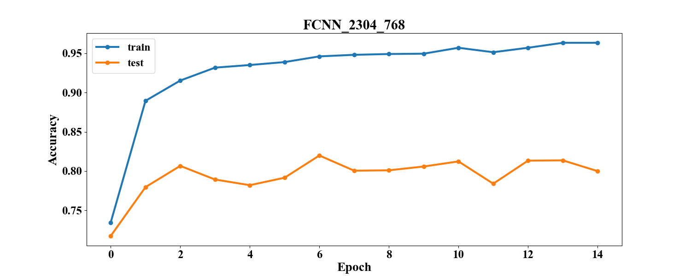            | 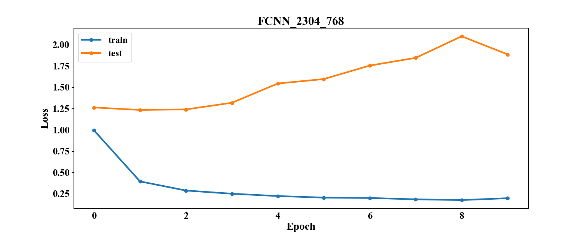            |
| 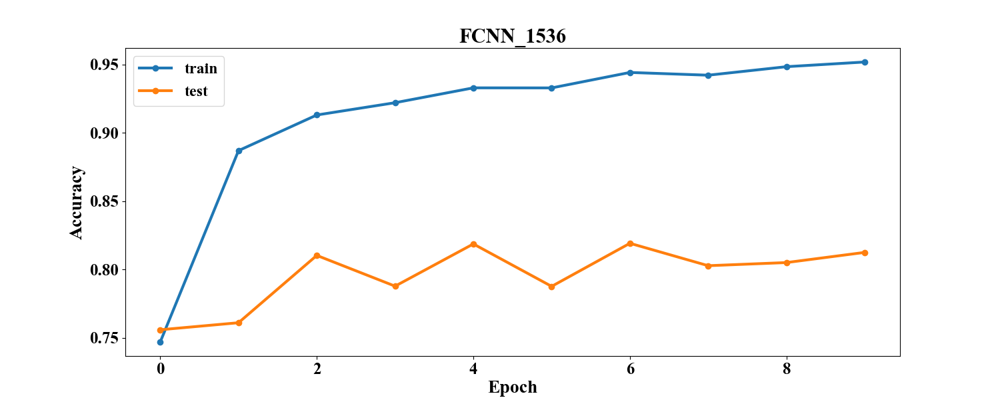                | 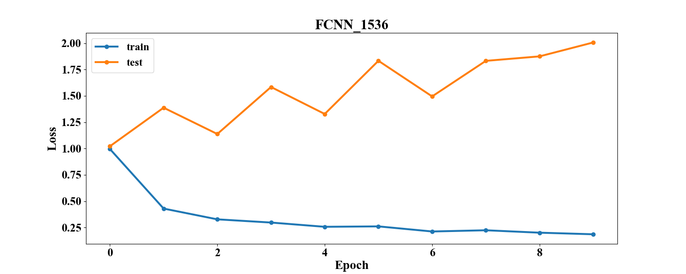                |
| 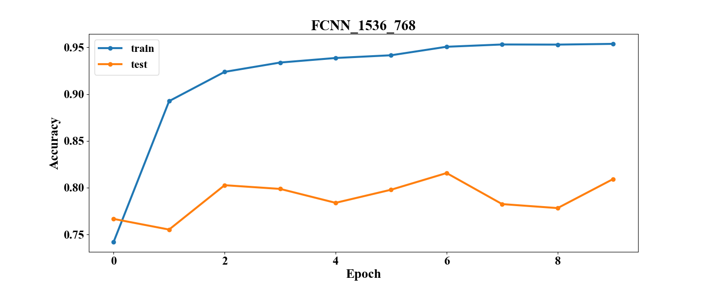            | 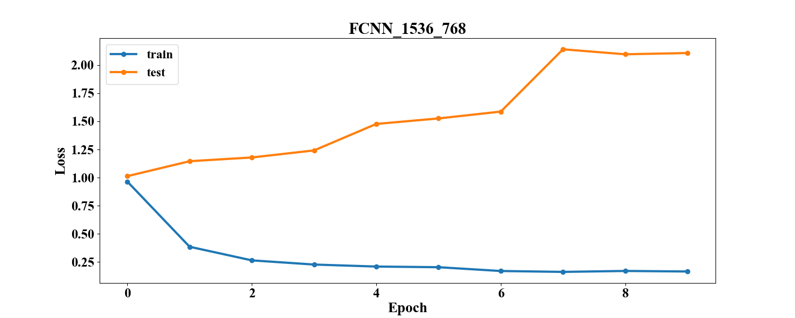            |
| 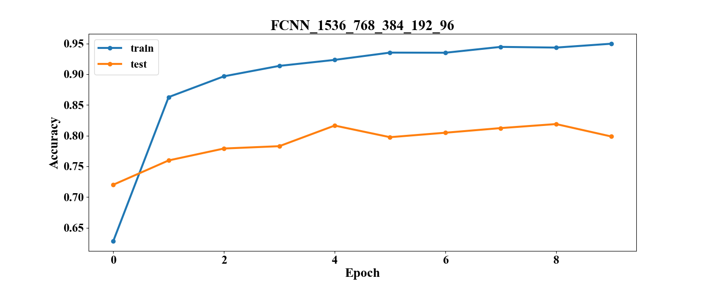 | 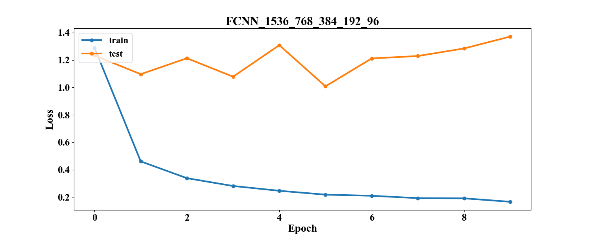 |

[comment]: # (graph_table_end)

### Анализ

