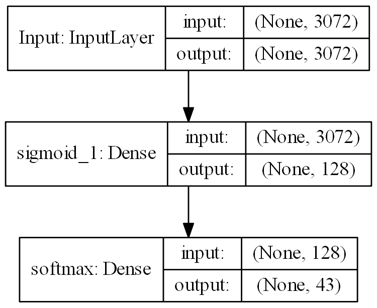
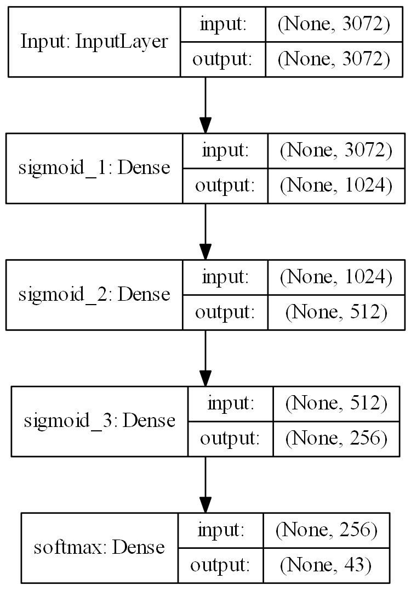
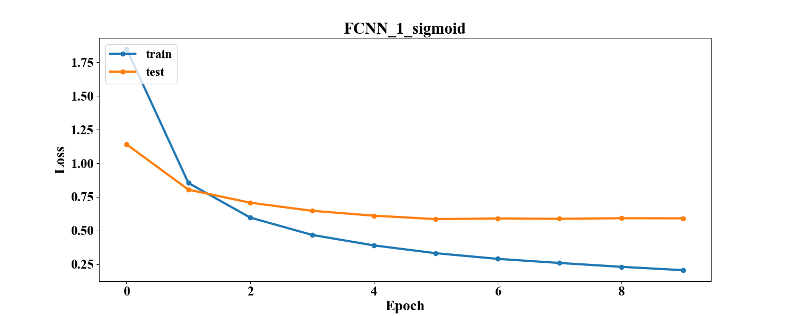
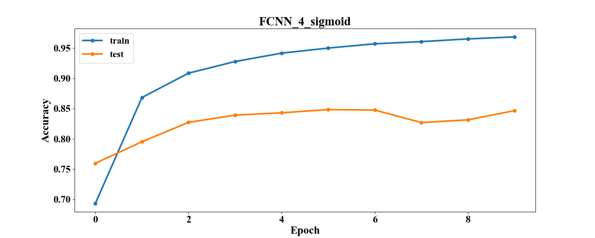
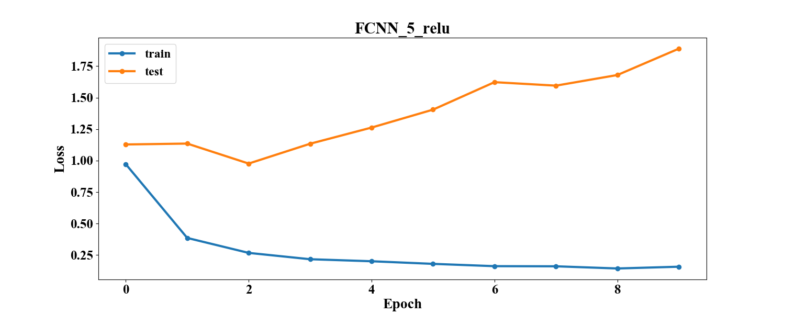
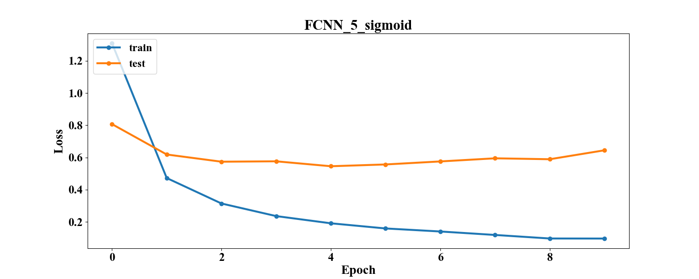
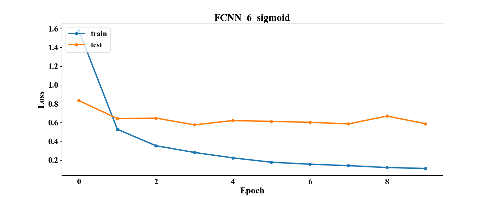

# Лабораторная работа №2

Реализация полносвязной нейронной сети (FCNN) для задачи классификации.

Сравнение конфигураций полносвязных нейронных сетей c разными функциями активации.

# Описание директорий

## img
Содержит изображения для отчёта.
### graph_loss_accuracy
Графики зависимости accuracy и функции потерь на тренировочной и тестовой выборке в зависимости от эпохи.
### graph_model
Графы конфигураций сетей.

## log
Здесь лежат файлы .json со статистикой по разным конфигурациям.
Они содержат параметры сети (число слоёв, число нейронов, функции активации, параметр обучения, размер пачки, число эпох)
и статистику обучения (время, функцию потерь на тестовом и тренировочном наборе, точность на тестовом и тренировочном наборе)

## models
Здесь лежат файлы .h5 с конфигурацией сетей Keras для их последующей повторной загрузки.

## ../src
Общие скрипты для работы с данными и отчётом.
### datahandler.py
Содержит методы для чтения данные и конвертации их в векторную или матричную форму.
### plthandler.py
Содержит методы для отрисовки и сохранения графиков.
### reporthandler.py
Содержит методы для генерации таблиц в отчётах по логам экспериментов.

## src
Частные скрипты для работы с данными и фреймворком.
### modelhandler.py
Содержит методы для работы с сетями: запуск обучения, сбор статистики, сохранение и загрузка сетей.
### notebook.py
Является точкой входа. Блокнот для проведения экспериментов. Содержит метод для запуска серийного эксперимента с 
возможностью настройки конфигураций сетей.

## Структура сетей

[comment]: # (graph_model_table_start)

|      Model name      |                  Model graph                  |
| :------------------- | :-------------------------------------------- |
| FCNN_1_elu_model     |      |
| FCNN_1_relu_model    |     |
| FCNN_1_sigmoid_model |  |
| FCNN_2_elu_model     |      |
| FCNN_2_relu_model    |     |
| FCNN_2_sigmoid_model |  |
| FCNN_3_elu_model     |      |
| FCNN_3_relu_model    |     |
| FCNN_3_sigmoid_model |  |
| FCNN_4_elu_model     |      |
| FCNN_4_relu_model    |     |
| FCNN_4_sigmoid_model |  |
| FCNN_5_elu_model     |      |
| FCNN_5_relu_model    |     |
| FCNN_5_sigmoid_model |  |
| FCNN_6_elu_model     |      |
| FCNN_6_relu_model    |     |
| FCNN_6_sigmoid_model |  |

[comment]: # (graph_model_table_end)

## Численные эксперименты
### Параметры

x_train = (86989, 3072)

y_train = (86989, 43)

x_test = (12630, 3072) 

y_test = (12630, 43)

loss = CrossEntropy 

optimizer = Adam

learning_rate = 0.001

batch_size = 128

num_epochs = 10

### Результаты
[comment]: # (result_table_start)

|   Model name   | Test accuracy | Test loss | Train accuracy | Train loss | Time_train (s) |
| :------------- | :-----------: | :-------: | :------------: | :--------: | :------------: |
| FCNN_1_elu     |    0.8253     |  1.0969   |     0.9716     |   0.1163   |    86.5257     |
| FCNN_2_elu     |     0.818     |  1.1678   |      0.95      |   0.1687   |    157.175     |
| FCNN_3_elu     |     0.815     |  1.4325   |     0.9578     |   0.1559   |    295.5643    |
| FCNN_4_elu     |    0.8337     |  1.5706   |     0.9562     |   0.1678   |    585.1944    |
| FCNN_5_elu     |    0.8012     |  2.0394   |     0.9562     |   0.1433   |    672.408     |
| FCNN_6_elu     |    0.8288     |   1.524   |     0.9721     |   0.0932   |    686.2314    |
| FCNN_1_relu    |    0.8183     |  1.1811   |     0.9721     |   0.1076   |    86.3335     |
| FCNN_2_relu    |    0.8139     |  1.2277   |     0.9642     |   0.1181   |    156.6193    |
| FCNN_3_relu    |    0.8314     |   1.379   |     0.9658     |   0.1182   |    297.2021    |
| FCNN_4_relu    |    0.8283     |  1.4746   |     0.9659     |   0.1197   |    577.8798    |
| FCNN_5_relu    |    0.8226     |  1.8887   |     0.9626     |   0.1533   |    676.6991    |
| FCNN_6_relu    |     0.82      |  1.6319   |     0.9567     |   0.131    |    678.0652    |
| FCNN_1_sigmoid |    0.8541     |  0.5912   |     0.9611     |   0.1951   |    87.2454     |
| FCNN_2_sigmoid |    0.8511     |  0.6252   |     0.9694     |   0.1501   |    155.5463    |
| FCNN_3_sigmoid |    0.8489     |  0.6699   |     0.9741     |   0.1204   |    296.1097    |
| FCNN_4_sigmoid |    0.8467     |  0.7243   |     0.9677     |   0.1244   |    584.1957    |
| FCNN_5_sigmoid |    0.8417     |  0.6444   |     0.963      |   0.1371   |    687.2353    |
| FCNN_6_sigmoid |    0.8545     |  0.5885   |     0.9783     |   0.0777   |    689.7557    |

[comment]: # (result_table_end)

[comment]: # (graph_table_start)

|                         Accuracy                         |                         Loss                         |
| :------------------------------------------------------- | :--------------------------------------------------- |
|      |      |
|     |     |
|  |  |
|      |      |
|     |     |
|  |  |
|      |      |
|     |     |
|  |  |
|      |      |
|     |     |
|  |  |
|      |      |
|     |     |
|  |  |
|      |      |
|     |     |
|  |  |

[comment]: # (graph_table_end)

### Анализ

Лучший результат показала сеть **FCNN_6_sigmoid [1024->sigmoid->512->sigmoid->256->sigmoid] - 0.8545**, но она обучалась 
дольше всех. Сети с активацией через sigmoid лучше других решают задачу классификации.

Лучший результат для ReLU: **FCNN_3_relu [512->ReLU] - 0.8314**.

Лучший результат для ELU: **FCNN_4_elu [1024->ELU] - 0.8337**.

Скорее всего модели слишком простые, им не хватило ёмкости для решения задачи.
