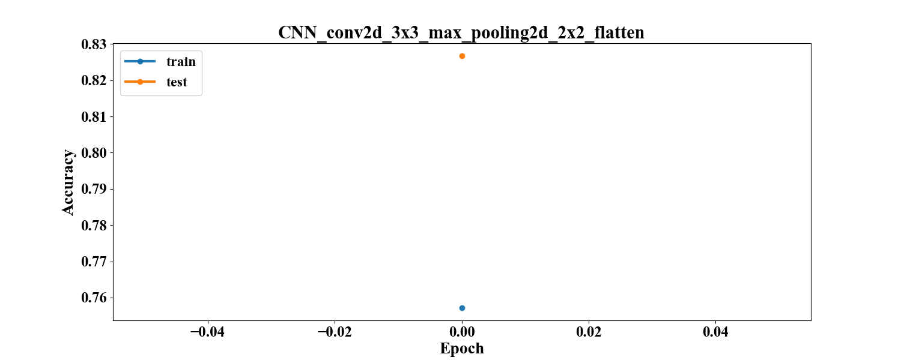
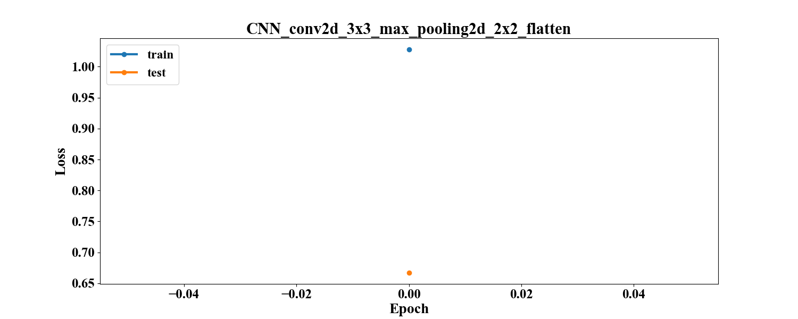

# Лабораторная работа №3
Реализация свёрточной нейронной сети для задачи классификации.

Сравнение конфигураций свёрточных нейронных сетей.

# Описание директорий

## log
Здесь лежат файлы .json со статистикой по разным конфигурациям.
Они содержат параметры сети (число слоёв, число нейронов, параметр обучения, размер пачки, число эпох) и статистику 
обучения (время, функцию потерь на тестовом и тренировочном наборе, точность на тестовом и тренировочном наборе)

## models
Здесь лежат файлы .h5 с конфигурацией сетей Keras для их последующей повторной загрузки.

## src
Скрипты для работы с данными и фреймворком.
### datahandler.py
Содержит методы для чтения, обработки, визуализации данных.
### modelhandler.py
Содержит методы для работы с сетью: запуск обучения, сбор статистики, сохранение и загрузка сетей.
### reporthandler.py
Содержит методы для генерации таблиц для отчёта.
### notebook.py
Является точкой входа. Блокнот для проведения экспериментов. Содержит метод для запуска серийного эксперимента с 
возможностью вариации количества скрытых слоёв и числа нейронов на них.

## Численные эксперименты
### Параметры

### Результаты
[comment]: # (result_table_start)

|                Model name                | Test accuracy | Test loss | Train accuracy | Train loss | Time_train (s) |
| :--------------------------------------- | :-----------: | :-------: | :------------: | :--------: | :------------: |
| CNN_conv2d_3x3_max_pooling2d_2x2_flatten |    0.8268     |  0.6671   |     0.9187     |   0.3953   |    48.5309     |

[comment]: # (result_table_end)

[comment]: # (graph_table_start)

|                            Accuracy                            |                            Loss                            |
| :------------------------------------------------------------- | :--------------------------------------------------------- |
|  |  |

[comment]: # (graph_table_end)

### Анализ

