# Лабораторная работа №3
Реализация свёрточной нейронной сети для задачи классификации.

Сравнение конфигураций свёрточных нейронных сетей.

# Описание директорий

## log
Здесь лежат файлы .json со статистикой по разным конфигурациям.
Они содержат параметры сети (число слоёв, число нейронов, параметр обучения, размер пачки, число эпох) и статистику 
обучения (время, функцию потерь на тестовом и тренировочном наборе, точность на тестовом и тренировочном наборе)

## models
Здесь лежат файлы .h5 с конфигурацией сетей Keras для их последующей повторной загрузки.

## src
Скрипты для работы с данными и фреймворком.
### datahandler.py
Содержит методы для чтения, обработки, визуализации данных.
### modelhandler.py
Содержит методы для работы с сетью: запуск обучения, сбор статистики, сохранение и загрузка сетей.
### reporthandler.py
Содержит методы для генерации таблиц для отчёта.
### notebook.py
Является точкой входа. Блокнот для проведения экспериментов. Содержит метод для запуска серийного эксперимента с 
возможностью вариации количества скрытых слоёв и числа нейронов на них.

## Численные эксперименты
### Параметры

### Результаты
[comment]: # (result_table_start)

|                                                      Model name                                                       | Test accuracy | Test loss | Train accuracy | Train loss | Time_train (s) |
| :-------------------------------------------------------------------------------------------------------------------- | :-----------: | :-------: | :------------: | :--------: | :------------: |
| CNN_conv2d_16_3x3_max_pooling2d_2x2_flatten_dense_300                                                                 |    0.8746     |  0.7346   |     0.9817     |   0.0751   |    248.1095    |
| CNN_conv2d_32_3x3_max_pooling2d_2x2_flatten_dense_128                                                                 |    0.8607     |  0.8779   |     0.9722     |   0.1015   |    289.3085    |
| CNN_conv2d_32_3x3_max_pooling2d_2x2_flatten_dense_300                                                                 |    0.8604     |  0.8973   |     0.9718     |   0.1106   |    424.3355    |
| CNN_conv2d_32_3x3_max_pooling2d_2x2_flatten_dense_500                                                                 |    0.8684     |  0.9368   |     0.9765     |   0.1093   |    582.2546    |
| CNN_conv2d_16_3x3_max_pooling2d_2x2_conv2d_32_3x3_max_pooling2d_2x2_flatten_dense_300                                 |    0.9013     |  0.5742   |     0.9925     |   0.0282   |    335.5144    |
| CNN_conv2d_32_3x3_max_pooling2d_2x2_conv2d_64_3x3_max_pooling2d_2x2_flatten_dense_300                                 |     0.921     |  0.3852   |     0.995      |   0.0201   |    565.3414    |
| CNN_conv2d_16_3x3_max_pooling2d_2x2_conv2d_32_3x3_max_pooling2d_2x2_conv2d_64_3x3_max_pooling2d_2x2_flatten_dense_300 |    0.8849     |  0.6501   |     0.9894     |   0.0337   |    357.0304    |

[comment]: # (result_table_end)

[comment]: # (graph_table_start)

|                                                                  Accuracy                                                                   |                                                                  Loss                                                                   |
| :------------------------------------------------------------------------------------------------------------------------------------------ | :-------------------------------------------------------------------------------------------------------------------------------------- |
| 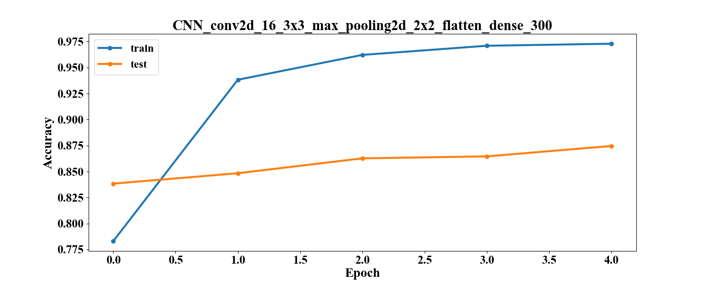                                                                 | 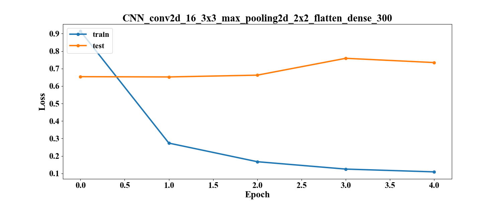                                                                 |
|                                                                  | 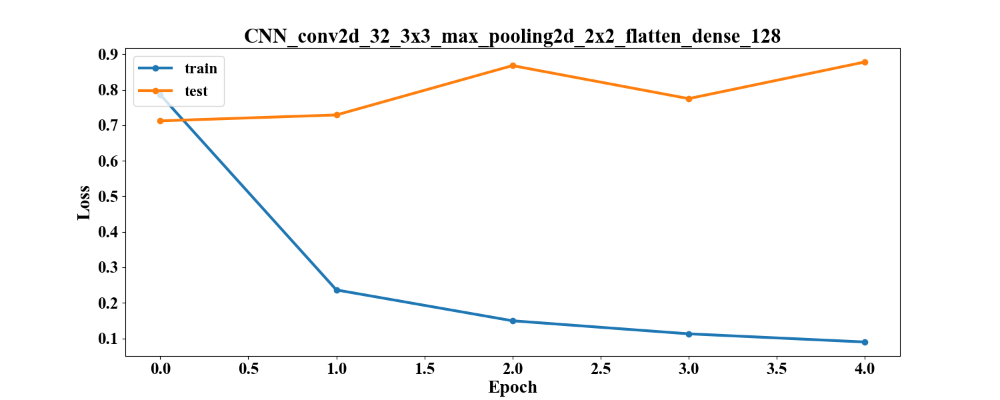                                                                 |
| 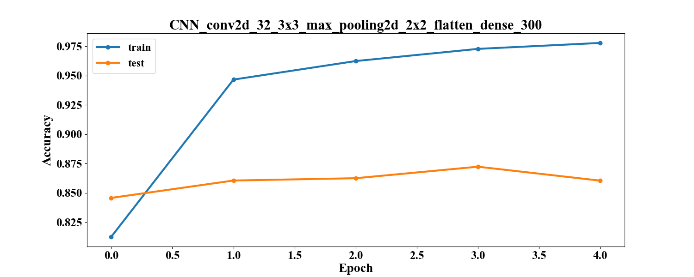                                                                 | 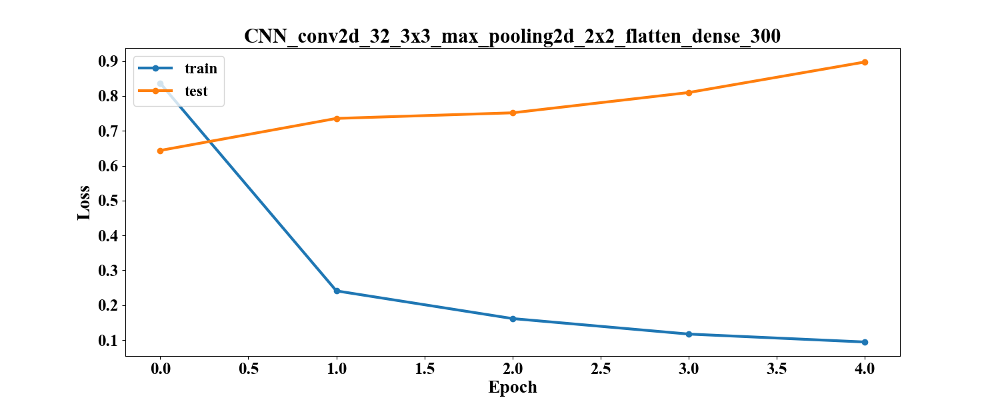                                                                 |
| 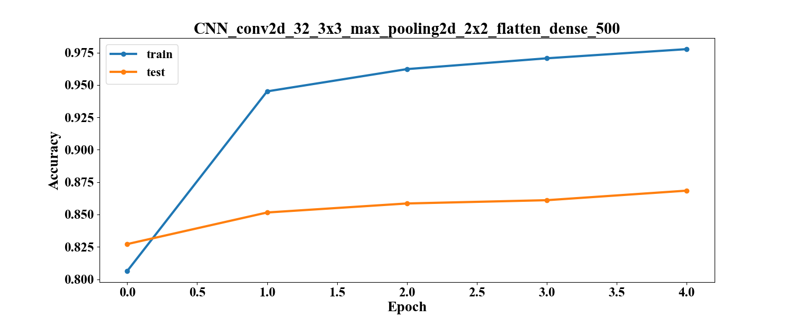                                                                 | 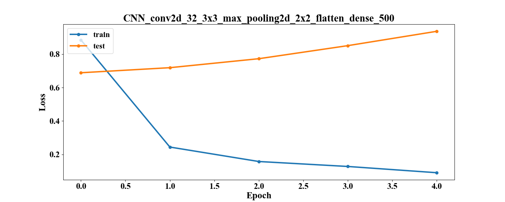                                                                 |
| 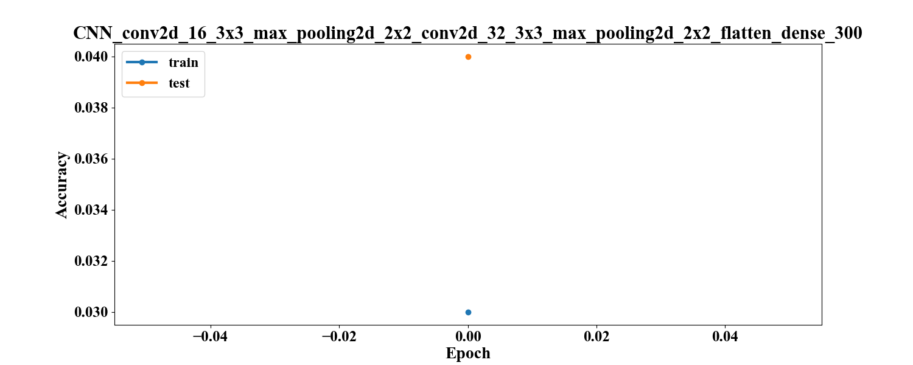                                 | 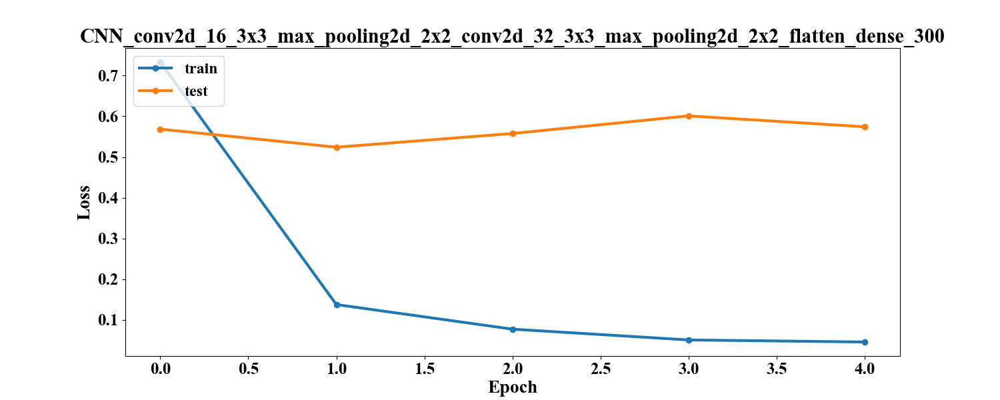                                 |
|                                  | 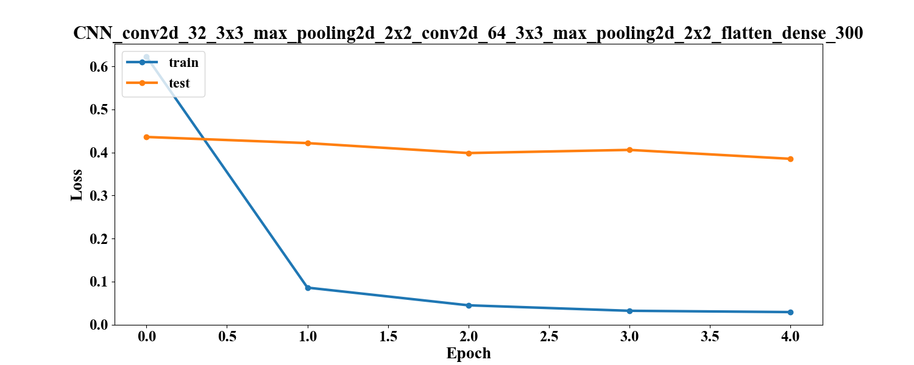                                 |
| 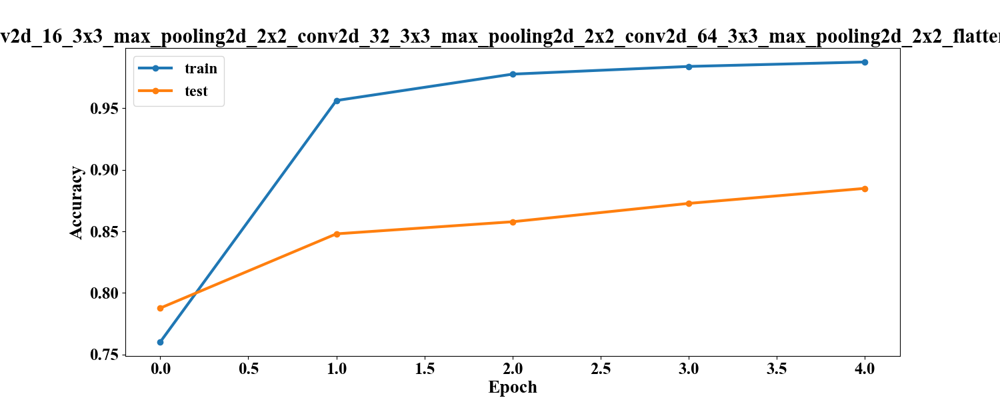 | 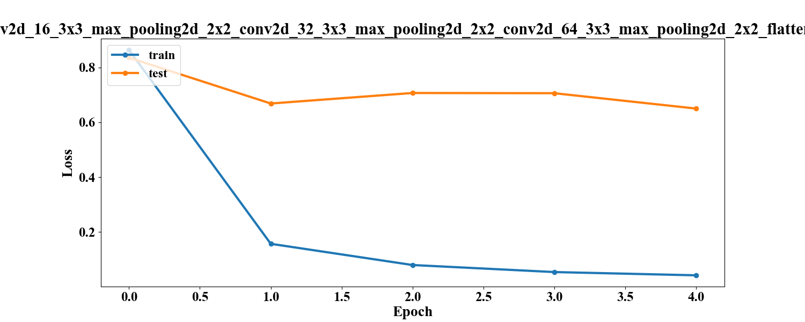 |

[comment]: # (graph_table_end)

### Анализ

