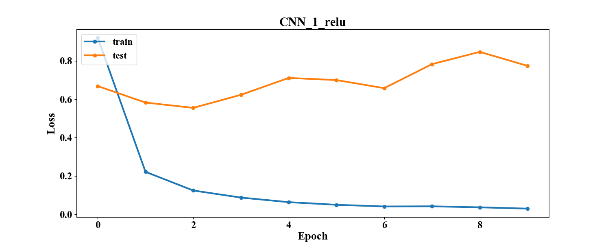
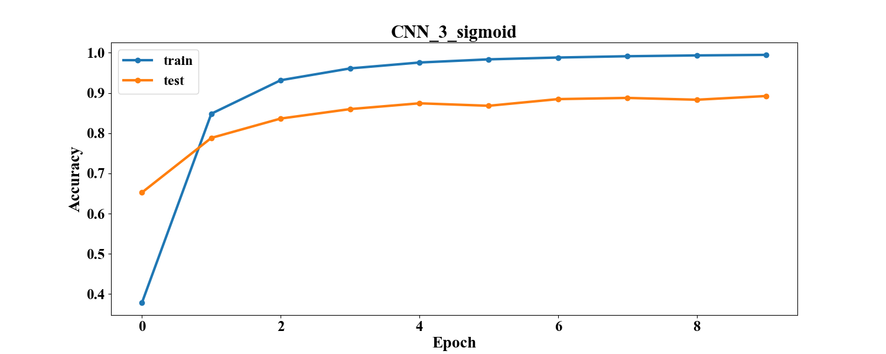

# Лабораторная работа №3
Реализация свёрточной нейронной сети (CNN) для задачи классификации.

Сравнение конфигураций свёрточных нейронных сетей c разными функциями активации.

# Описание директорий

## img
Содержит изображения для отчёта.
### graph_loss_accuracy
Графики зависимости accuracy и функции потерь на тренировочной и тестовой выборке в зависимости от эпохи.
### graph_model
Графы конфигураций сетей.

## log
Здесь лежат файлы .json со статистикой по разным конфигурациям.
Они содержат параметры сети (число слоёв, число нейронов, функции активации, параметр обучения, размер пачки, число эпох)
и статистику обучения (время, функцию потерь на тестовом и тренировочном наборе, точность на тестовом и тренировочном наборе)

## models
Здесь лежат файлы .h5 с конфигурацией сетей Keras для их последующей повторной загрузки.

## ../src
Общие скрипты для работы с данными и отчётом.
### datahandler.py
Содержит методы для чтения данные и конвертации их в векторную или матричную форму.
### plthandler.py
Содержит методы для отображения и сохранения графиков.
### reporthandler.py
Содержит методы для генерации таблиц в отчётах по логам экспериментов.

## src
Частные скрипты для работы с данными и фреймворком.
### modelhandler.py
Содержит методы для работы с сетями: запуск обучения, сбор статистики, сохранение и загрузка сетей.
### notebook.py
Является точкой входа. Блокнот для проведения экспериментов. Содержит метод для запуска серийного эксперимента с 
возможностью настройки конфигураций сетей.

## Структура сетей

[comment]: # (graph_model_table_start)

|         Model name          |                     Model graph                      |
| :-------------------------- | :--------------------------------------------------- |
| CNN_1_elu_model             |              |
| CNN_1_relu_model            |             |
| CNN_1_sigmoid_model         |          |
| CNN_2_elu_dropout_model     |      |
| CNN_2_relu_dropout_model    |     |
| CNN_2_sigmoid_dropout_model |  |
| CNN_3_elu_model             |              |
| CNN_3_relu_model            |             |
| CNN_3_sigmoid_model         |          |
| CNN_4_elu_dropout_model     |      |
| CNN_4_relu_dropout_model    |     |
| CNN_4_sigmoid_dropout_model |  |
| CNN_5_elu_model             |              |
| CNN_5_relu_model            |             |
| CNN_5_sigmoid_model         |          |
| CNN_6_elu_dropout_model     |      |
| CNN_6_relu_dropout_model    |     |
| CNN_6_sigmoid_dropout_model |  |

[comment]: # (graph_model_table_end)

## Численные эксперименты
### Параметры
x_train = (86989, (32, 32, 3))

y_train = (86989, 43)

x_test = (12630, (32, 32, 3)) 

y_test = (12630, 43)

loss = CrossEntropy 

optimizer = Adam

learning_rate = 0.001

batch_size = 128

num_epochs = 10

### Результаты
[comment]: # (result_table_start)

|      Model name       | Test accuracy | Test loss | Train accuracy | Train loss | Time_train (s) |
| :-------------------- | :-----------: | :-------: | :------------: | :--------: | :------------: |
| CNN_1_elu             |    0.8801     |  1.1476   |     0.9959     |   0.0174   |    800.8384    |
| CNN_3_elu             |    0.9094     |  0.8882   |     0.9957     |   0.0247   |   1101.1085    |
| CNN_5_elu             |    0.8951     |  0.8769   |     0.9923     |   0.0241   |    790.2303    |
| CNN_1_relu            |    0.8823     |  0.7741   |     0.9941     |   0.0216   |    781.0184    |
| CNN_3_relu            |    0.9111     |  0.5632   |     0.9938     |   0.0234   |   1066.1482    |
| CNN_5_relu            |    0.8727     |  0.8005   |     0.9923     |   0.0218   |    766.4206    |
| CNN_1_sigmoid         |     0.808     |  0.7678   |     0.8956     |   0.3995   |    801.3745    |
| CNN_3_sigmoid         |    0.8924     |   0.389   |     0.9964     |   0.0232   |   1081.7477    |
| CNN_5_sigmoid         |    0.8122     |  0.7203   |     0.9884     |   0.0547   |    771.3893    |
| CNN_2_elu_dropout     |    0.8831     |  1.1037   |     0.9954     |   0.0156   |    875.3395    |
| CNN_4_elu_dropout     |    0.9139     |  0.5692   |     0.9963     |   0.0129   |   1213.8117    |
| CNN_6_elu_dropout     |    0.8962     |  0.5066   |     0.997      |   0.0117   |    844.8452    |
| CNN_2_relu_dropout    |     0.88      |  0.7938   |     0.9897     |   0.036    |    856.6438    |
| CNN_4_relu_dropout    |    0.9196     |  0.3463   |     0.9985     |   0.0096   |   1171.3076    |
| CNN_6_relu_dropout    |    0.8645     |  0.5494   |     0.9946     |   0.0244   |    834.5455    |
| CNN_2_sigmoid_dropout |    0.3833     |  1.8429   |     0.4341     |   1.8047   |    864.0562    |
| CNN_4_sigmoid_dropout |    0.8178     |  0.5992   |     0.9821     |   0.0804   |   1190.1844    |
| CNN_6_sigmoid_dropout |    0.6344     |  1.2289   |     0.9238     |   0.2938   |    827.8438    |

[comment]: # (result_table_end)

[comment]: # (graph_table_start)

|                            Accuracy                             |                            Loss                             |
| :-------------------------------------------------------------- | :---------------------------------------------------------- |
|              |              |
|             |             |
|          |          |
|      |      |
|     |     |
|  |  |
|              |              |
|             |             |
|          |          |
|      |      |
|     |     |
|  |  |
|              |              |
|             |             |
|          |          |
|      |      |
|     |     |
|  |  |

[comment]: # (graph_table_end)

### Анализ

