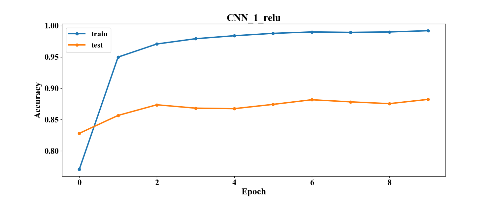
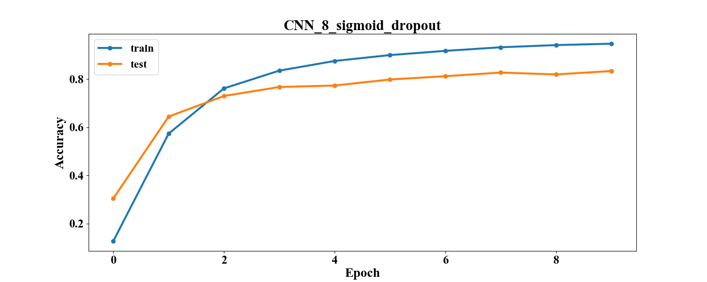
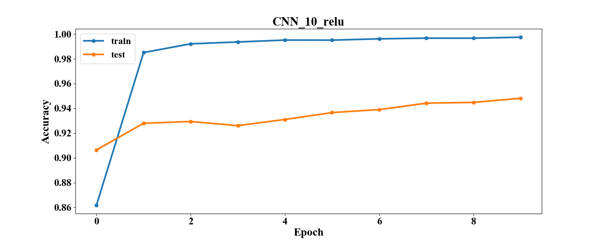
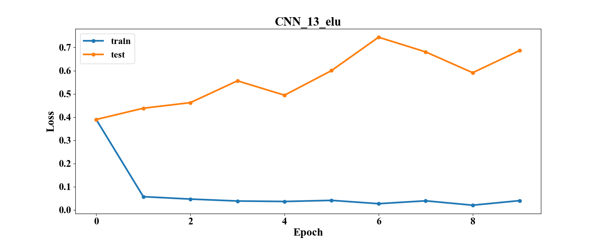
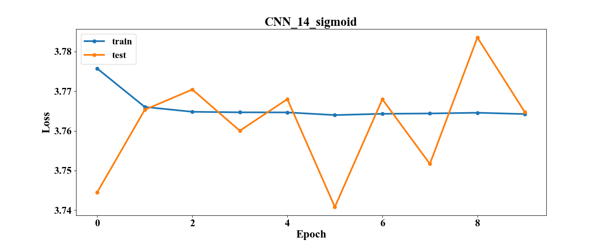

# Лабораторная работа №3
Реализация свёрточной нейронной сети (CNN) для задачи классификации.

Сравнение конфигураций свёрточных нейронных сетей c разными функциями активации.

# Описание директорий

## img
Содержит изображения для отчёта.
### graph_loss_accuracy
Графики зависимости accuracy и функции потерь на тренировочной и тестовой выборке в зависимости от эпохи.
### graph_model
Графы конфигураций сетей.

## log
Здесь лежат файлы .json со статистикой по разным конфигурациям.
Они содержат параметры сети (число слоёв, число нейронов, функции активации, параметр обучения, размер пачки, число эпох)
и статистику обучения (время, функцию потерь на тестовом и тренировочном наборе, точность на тестовом и тренировочном наборе)

## models
Здесь лежат файлы .h5 с конфигурацией сетей Keras для их последующей повторной загрузки.

## ../src
Общие скрипты для работы с данными и отчётом.
### datahandler.py
Содержит методы для чтения данные и конвертации их в векторную или матричную форму.
### plthandler.py
Содержит методы для отображения и сохранения графиков.
### reporthandler.py
Содержит методы для генерации таблиц в отчётах по логам экспериментов.

## src
Частные скрипты для работы с данными и фреймворком.
### modelhandler.py
Содержит методы для работы с сетями: запуск обучения, сбор статистики, сохранение и загрузка сетей.
### notebook.py
Является точкой входа. Блокнот для проведения экспериментов. Содержит метод для запуска серийного эксперимента с 
возможностью настройки конфигураций сетей.

## Структура сетей

[comment]: # (graph_model_table_start)

|         Model name          |                     Model graph                      |
| :-------------------------- | :--------------------------------------------------- |
| CNN_1_elu_model             |              |
| CNN_1_relu_model            |             |
| CNN_1_sigmoid_model         |          |
| CNN_2_elu_dropout_model     |      |
| CNN_2_relu_dropout_model    |     |
| CNN_2_sigmoid_dropout_model |  |
| CNN_3_elu_model             |              |
| CNN_3_relu_model            |             |
| CNN_3_sigmoid_model         |          |
| CNN_4_elu_dropout_model     |      |
| CNN_4_relu_dropout_model    |     |
| CNN_4_sigmoid_dropout_model |  |
| CNN_5_elu_model             |              |
| CNN_5_relu_model            |             |
| CNN_5_sigmoid_model         |          |
| CNN_6_elu_dropout_model     |      |
| CNN_6_relu_dropout_model    |     |
| CNN_6_sigmoid_dropout_model |  |
| CNN_7_elu_model             |              |
| CNN_7_relu_model            |             |
| CNN_7_sigmoid_model         |          |
| CNN_8_elu_dropout_model     |      |
| CNN_8_relu_dropout_model    |     |
| CNN_8_sigmoid_dropout_model |  |
| CNN_9_elu_model             |              |
| CNN_9_relu_model            |             |
| CNN_9_sigmoid_model         |          |
| CNN_10_elu_model            |             |
| CNN_10_relu_model           |            |
| CNN_10_sigmoid_model        |         |
| CNN_11_elu_model            |             |
| CNN_11_relu_model           |            |
| CNN_11_sigmoid_model        |         |
| CNN_12_elu_model            |             |
| CNN_12_relu_model           |            |
| CNN_12_sigmoid_model        |         |
| CNN_13_elu_model            |             |
| CNN_13_relu_model           |            |
| CNN_13_sigmoid_model        |         |
| CNN_14_elu_model            |             |
| CNN_14_relu_model           |            |
| CNN_14_sigmoid_model        |         |

[comment]: # (graph_model_table_end)

## Численные эксперименты
### Параметры
x_train = (86989, (32, 32, 3))

y_train = (86989, 43)

x_test = (12630, (32, 32, 3)) 

y_test = (12630, 43)

loss = CrossEntropy 

optimizer = Adam

learning_rate = 0.001

batch_size = 128

num_epochs = 10

### Результаты
[comment]: # (result_table_start)

|      Model name       | Test accuracy | Test loss | Train accuracy | Train loss | Time_train (s) |
| :-------------------- | :-----------: | :-------: | :------------: | :--------: | :------------: |
| CNN_1_elu             |    0.8801     |  1.1476   |     0.9959     |   0.0174   |    800.8384    |
| CNN_3_elu             |    0.9094     |  0.8882   |     0.9957     |   0.0247   |   1101.1085    |
| CNN_5_elu             |    0.8951     |  0.8769   |     0.9923     |   0.0241   |    790.2303    |
| CNN_7_elu             |    0.9441     |  0.7605   |     0.9957     |   0.0228   |   2705.2305    |
| CNN_9_elu             |    0.9339     |  0.6168   |     0.9977     |   0.0096   |   1710.7036    |
| CNN_10_elu            |    0.9454     |   0.632   |     0.998      |   0.0081   |   2122.1241    |
| CNN_11_elu            |    0.9453     |   1.142   |     0.9954     |   0.0269   |   4098.6694    |
| CNN_12_elu            |    0.9151     |  0.8973   |     0.9923     |   0.0326   |   1314.5737    |
| CNN_13_elu            |    0.9286     |  0.6866   |     0.9928     |   0.0347   |    2169.671    |
| CNN_14_elu            |    0.9465     |  0.5064   |     0.9956     |   0.0201   |   2245.1453    |
| CNN_1_relu            |    0.8823     |  0.7741   |     0.9941     |   0.0216   |    781.0184    |
| CNN_3_relu            |    0.9111     |  0.5632   |     0.9938     |   0.0234   |   1066.1482    |
| CNN_5_relu            |    0.8727     |  0.8005   |     0.9923     |   0.0218   |    766.4206    |
| CNN_7_relu            |    0.9315     |  0.4822   |     0.998      |   0.0067   |   2640.5666    |
| CNN_9_relu            |    0.9401     |  0.3631   |     0.9964     |   0.0112   |   1664.5328    |
| CNN_10_relu           |    0.9481     |  0.3136   |     0.999      |   0.0033   |   2071.7088    |
| CNN_11_relu           |    0.9432     |  0.3532   |     0.9955     |   0.0149   |   3999.6061    |
| CNN_12_relu           |     0.926     |  0.4359   |     0.9965     |   0.0115   |    1303.817    |
| CNN_13_relu           |    0.9328     |  0.3658   |     0.9972     |   0.0087   |   2119.9925    |
| CNN_14_relu           |    0.9416     |  0.3321   |     0.9967     |   0.0104   |   2178.3999    |
| CNN_1_sigmoid         |     0.808     |  0.7678   |     0.8956     |   0.3995   |    801.3745    |
| CNN_3_sigmoid         |    0.8924     |   0.389   |     0.9964     |   0.0232   |   1081.7477    |
| CNN_5_sigmoid         |    0.8122     |  0.7203   |     0.9884     |   0.0547   |    771.3893    |
| CNN_7_sigmoid         |    0.8526     |  0.5881   |     0.9984     |   0.0105   |   2685.1879    |
| CNN_9_sigmoid         |    0.8833     |  0.4122   |     0.9909     |   0.0401   |   1670.2351    |
| CNN_10_sigmoid        |    0.8952     |  0.4313   |     0.9981     |   0.0134   |   2089.5842    |
| CNN_11_sigmoid        |    0.8866     |  0.4321   |     0.9979     |   0.0115   |   4036.7329    |
| CNN_12_sigmoid        |    0.8569     |  0.5909   |     0.9949     |   0.0235   |   1308.9783    |
| CNN_13_sigmoid        |    0.8526     |  0.5846   |     0.993      |   0.0301   |    2138.743    |
| CNN_14_sigmoid        |    0.0285     |  3.7647   |     0.0233     |   3.7642   |   2204.1186    |
| CNN_2_elu_dropout     |    0.8831     |  1.1037   |     0.9954     |   0.0156   |    875.3395    |
| CNN_4_elu_dropout     |    0.9139     |  0.5692   |     0.9963     |   0.0129   |   1213.8117    |
| CNN_6_elu_dropout     |    0.8962     |  0.5066   |     0.997      |   0.0117   |    844.8452    |
| CNN_8_elu_dropout     |    0.9341     |  0.4939   |     0.9977     |   0.0069   |   2946.4386    |
| CNN_2_relu_dropout    |     0.88      |  0.7938   |     0.9897     |   0.036    |    856.6438    |
| CNN_4_relu_dropout    |    0.9196     |  0.3463   |     0.9985     |   0.0096   |   1171.3076    |
| CNN_6_relu_dropout    |    0.8645     |  0.5494   |     0.9946     |   0.0244   |    834.5455    |
| CNN_8_relu_dropout    |    0.9283     |   0.374   |     0.9985     |   0.0062   |   2872.0986    |
| CNN_2_sigmoid_dropout |    0.3833     |  1.8429   |     0.4341     |   1.8047   |    864.0562    |
| CNN_4_sigmoid_dropout |    0.8178     |  0.5992   |     0.9821     |   0.0804   |   1190.1844    |
| CNN_6_sigmoid_dropout |    0.6344     |  1.2289   |     0.9238     |   0.2938   |    827.8438    |
| CNN_8_sigmoid_dropout |    0.8336     |  0.5853   |     0.989      |   0.0457   |   2920.1338    |

[comment]: # (result_table_end)

[comment]: # (graph_table_start)

|                            Accuracy                             |                            Loss                             |
| :-------------------------------------------------------------- | :---------------------------------------------------------- |
|              |              |
|             |             |
|          |          |
|      |      |
|     |     |
|  |  |
|              |              |
|             |             |
|          |          |
|      |      |
|     |     |
|  |  |
|              |              |
|             |             |
|          |          |
|      |      |
|     |     |
|  |  |
|              |              |
|             |             |
|          |          |
|      |      |
|     |     |
|  |  |
|              |              |
|             |             |
|          |          |
|             |             |
|            |            |
|         |         |
|             |             |
|            |            |
|         |         |
|             |             |
|            |            |
|         |         |
|             |             |
|            |            |
|         |         |
|             |             |
|            |            |
|         |         |

[comment]: # (graph_table_end)

### Анализ

Лучший результат показала сеть **CNN_10_relu - 0.9481**.

Лучший результат для ELU: **CNN_14_elu - 0.9465**.

Лучший результат для Sigmoid: **CNN_10_sigmoid - 0.8952**.

Применение dropout не сильно улучшило результат.

