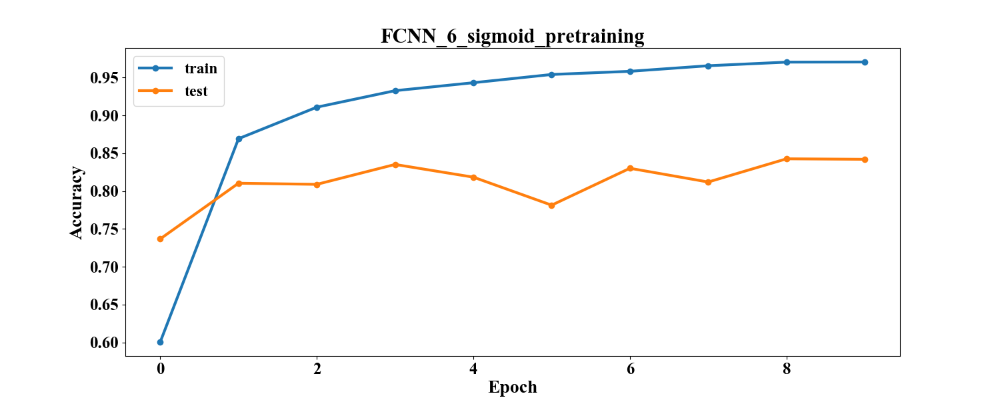
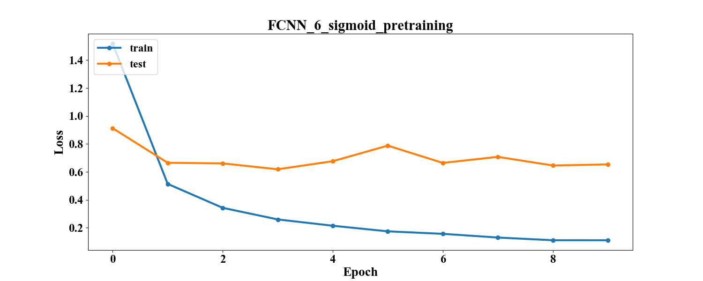

# Лабораторная работа №4
В ходе лабораторной работы необходимо реализовать несколько методов обучения без учителя.

На основе этих методов получить начальные значения весов для некоторых моделей и обучить их.

Сравнить результаты с моделями, которые были обучены со случайными весами.

# Реализованные подходы

## Автокодировщик (с регуляризацией)
Autoencoder пытается максимально приблизить значение на выходе к значению на входе.
Состоит из двух частей: encoder и decoder.

Encoder - кодирует входные данные: =s_f(W_h*x;b_h))

Decoder - восстанавливает входные данные: )

Автокодировщик является сетью прямого распространения, можно обучать через обратное распространение ошибки.

Цель обучения - минимизация отличий между входом и выходом.

\rightarrow&space;min)
 
В качестве функции ошибки можно использовать кросс-энтропию или среднеквадратичную ошибку:

&space;=&space;\frac{1}{n}\sum_{i=1}^{n}&space;\left&space;(&space;x_i&space;-&space;y_i&space;\right&space;)^{2})

Задача обучения:
 
=\sum_{x\in&space;D_n}L\left&space;(x,g(f(x))\right)\rightarrow\underset{\Theta=\left\{W_h,W_y,b_n,b_y\right\}}{min})

Где  - обучаемые параметры сети

Для борьбы с переобучением используется регуляризация. Её можно внести на скрытый слой с параметром  порядка :

=\sum_{x&space;\in&space;D_n}&space;L&space;\left(x,g(f(x))\right)&plus;\lambda&space;\sum_{i,j}w_{i,j}&space;\rightarrow&space;\underset{\Theta}{min})

## Стек автокодировщиков
Может быть применен при работе с глубокими сетями. Каждый автокодировщик обучается как сеть прямого распространения и работает с одним слоем.
Это позволяет постепенно снижать размерность и настраивать параметры.

## Разверточные нейронные сети
Популярны в задаче семантической сегментации. Состоят из двух блоков: сверточный слой – последовательное
применение преобразований свертки, функции активации и пространственного объединения;
развертывающий слой – выполнение обратных преобразований расщепления, активации
и развертывания.

# Выбранные модели
Из проведенных экспериментов были отобраны модели,
которые показали лучший результат среди полносвязных и сверточных сетей: FCNN_6_sigmoid и CNN_10_relu.

Помимо этого, были взяты лучшие сети с минимальной конфигурацией: FCNN_1_sigmoid и CNN_1_relu.

##FCNN_1_sigmoid
|         Model name          |                     Model graph                       |
| :-------------------------- | :---------------------------------------------------- |
| FCNN_1_sigmoid              |  |

|                            Accuracy                             |                            Loss                             |
| :-------------------------------------------------------------- | :---------------------------------------------------------- |
| | |

|   Model name   | Test accuracy | Test loss | Train accuracy | Train loss | Time_train (s) |
| :------------- | :-----------: | :-------: | :------------: | :--------: | :------------: |
| FCNN_1_sigmoid |    0.8541     |  0.5912   |     0.9611     |   0.1951   |    87.2454     |

##FCNN_6_sigmoid

|         Model name          |                     Model graph                       |
| :-------------------------- | :---------------------------------------------------- |
| FCNN_6_sigmoid              |  |

|                            Accuracy                             |                            Loss                             |
| :-------------------------------------------------------------- | :---------------------------------------------------------- |
| | |

|   Model name   | Test accuracy | Test loss | Train accuracy | Train loss | Time_train (s) |
| :------------- | :-----------: | :-------: | :------------: | :--------: | :------------: |
| FCNN_6_sigmoid |    0.8545     |  0.5885   |     0.9783     |   0.0777   |    689.7557    |

##CNN_1_relu

|         Model name          |                     Model graph                      |
| :-------------------------- | :--------------------------------------------------- |
| CNN_1_relu                  |     |

|                            Accuracy                             |                            Loss                             |
| :-------------------------------------------------------------- | :---------------------------------------------------------- |
|     |     |

|      Model name       | Test accuracy | Test loss | Train accuracy | Train loss | Time_train (s) |
| :-------------------- | :-----------: | :-------: | :------------: | :--------: | :------------: |
| CNN_1_relu            |    0.8823     |  0.7741   |     0.9941     |   0.0216   |    781.0184    |

##CNN_10_relu

|         Model name          |                     Model graph                      |
| :-------------------------- | :--------------------------------------------------- |
| CNN_10_relu                 |    |

|                            Accuracy                             |                            Loss                             |
| :-------------------------------------------------------------- | :---------------------------------------------------------- |
|    |    |

|      Model name       | Test accuracy | Test loss | Train accuracy | Train loss | Time_train (s) |
| :-------------------- | :-----------: | :-------: | :------------: | :--------: | :------------: |
| CNN_10_relu           |    0.9481     |  0.3136   |     0.999      |   0.0033   |   2071.7088    |

# Описание директорий

## img
Содержит изображения для отчёта.
### graph_loss_accuracy
Графики зависимости accuracy и функции потерь на тренировочной и тестовой выборке в зависимости от эпохи.
### graph_model
Графы конфигураций сетей.

## log
Здесь лежат файлы .json со статистикой по разным конфигурациям.
Они содержат параметры сети (число слоёв, число нейронов, функции активации, параметр обучения, размер пачки, число эпох)
и статистику обучения (время, функцию потерь на тестовом и тренировочном наборе, точность на тестовом и тренировочном наборе)

## models
Здесь лежат файлы .h5 с конфигурацией сетей Keras для их последующей повторной загрузки.

## ../src
Общие скрипты для работы с данными и отчётом.
### datahandler.py
Содержит методы для чтения данные и конвертации их в векторную или матричную форму.
### plthandler.py
Содержит методы для отображения и сохранения графиков.
### reporthandler.py
Содержит методы для генерации таблиц в отчётах по логам экспериментов.

## src
Частные скрипты для работы с данными и фреймворком.
### modelhandler.py
Содержит методы для работы с сетями: запуск обучения, сбор статистики, сохранение и загрузка сетей.
### notebook.py
Является точкой входа. Блокнот для проведения экспериментов. Содержит метод для запуска серийного эксперимента с 
возможностью настройки конфигураций сетей.

# Численные эксперименты
## Параметры
x_train = (86989, (32, 32, 3))

y_train = (86989, 43)

x_test = (12630, (32, 32, 3)) 

y_test = (12630, 43)

loss = CrossEntropy 

loss = MeanSquaredError - для моделей с обучением без учителя

optimizer = Adam

learning_rate = 0.001

batch_size = 128

num_epochs = 10

## Сравнение для FCNN

### FCNN_1_sigmoid

|              Model name               | Test accuracy | Test loss | Train accuracy | Train loss | Time_train (s) |
| :------------------------------------ | :-----------: | :-------: | :------------: | :--------: | :------------: |
| FCNN_1_sigmoid                        |    0.8541     |  0.5912   |     0.9611     |   0.1951   |    87.2454     |
| FCNN_1_sigmoid_pretraining            |    0.8546     |  0.5828   |     0.9611     |   0.1976   |    102.8282    |

|              Model name               |                            Accuracy                                    |                            Loss                                    |
| :------------------------------------ | :--------------------------------------------------------------------- | :----------------------------------------------------------------- |
| FCNN_1_sigmoid                        |        |        |
| FCNN_1_sigmoid_pretraining            |    |    |

### FCNN_6_sigmoid

|              Model name               | Test accuracy | Test loss | Train accuracy | Train loss | Time_train (s) |
| :------------------------------------ | :-----------: | :-------: | :------------: | :--------: | :------------: |
| FCNN_6_sigmoid                        |    0.8545     |  0.5885   |     0.9783     |   0.0777   |    689.7557    |
| FCNN_6_sigmoid_pretraining            |     0.842     |  0.6536   |     0.9828     |   0.0709   |    697.6593    |
| FCNN_6_sigmoid_pretraining_0.0001     |    0.8419     |  0.5944   |     0.9656     |   0.1477   |    702.888     |
| FCNN_6_sigmoid_pretraining_with_stack |    0.8456     |  0.6361   |     0.9759     |   0.0873   |    689.8882    |

|              Model name               |                            Accuracy                                    |                            Loss                                    |
| :------------------------------------ | :--------------------------------------------------------------------- | :----------------------------------------------------------------- |
| FCNN_6_sigmoid                        |        |        |
| FCNN_6_sigmoid_pretraining            |    |    |

### Таблица для автокодировщиков

|              Model name               | Test accuracy | Test loss | Train accuracy | Train loss | Time_train (s) |
| :------------------------------------ | :-----------: | :-------: | :------------: | :--------: | :------------: |
| FCNN_1_sigmoid_autoencoder            |     0.599     |  0.0183   |     0.5801     |   0.0198   |    250.9933    |
| FCNN_6_sigmoid_autoencoder            |    0.5114     |  0.0234   |     0.4855     |   0.023    |   1508.7251    |
| FCNN_6_sigmoid_autoencoder_0.0001     |    0.3367     |  0.0751   |     0.3363     |   0.0533   |   1507.0768    |
| FCNN_6_sigmoid_autoencoder_1_stack    |    0.6576     |  0.0137   |     0.6345     |   0.017    |    1246.62     |
| FCNN_6_sigmoid_autoencoder_2_stack    |    0.6008     |  0.0022   |     0.5904     |   0.0015   |    216.447     |
| FCNN_6_sigmoid_autoencoder_3_stack    |    0.7311     |  0.0016   |     0.7354     |   0.0012   |    31.2123     |

## Сравнение для СNN

### CNN_1_relu
|              Model name               | Test accuracy | Test loss | Train accuracy | Train loss | Time_train (s) |
| :------------------------------------ | :-----------: | :-------: | :------------: | :--------: | :------------: |
| CNN_1_relu                            |    0.8823     |  0.7741   |     0.9941     |   0.0216   |    781.0184    |
| CNN_1_relu_pretraining                |    0.8898     |  0.7241   |     0.9895     |   0.0397   |    783.3383    |

|              Model name           |                            Accuracy                                    |                            Loss                                    |
| :-------------------------------- | :--------------------------------------------------------------------- | :----------------------------------------------------------------- |
| CNN_1_relu                        |            |            |
| CNN_1_relu_pretraining            |        |        |

### CNN_10_relu

|              Model name               | Test accuracy | Test loss | Train accuracy | Train loss | Time_train (s) |
| :------------------------------------ | :-----------: | :-------: | :------------: | :--------: | :------------: |
| CNN_10_relu                           |    0.9481     |  0.3136   |     0.999      |   0.0033   |   2071.7088    |
| CNN_10_relu_pretraining               |    0.9481     |  0.2589   |     0.9978     |   0.0068   |   2067.4936    |

### Таблица для автокодировщиков

|              Model name               | Test accuracy | Test loss | Train accuracy | Train loss | Time_train (s) |
| :------------------------------------ | :-----------: | :-------: | :------------: | :--------: | :------------: |
| CNN_1_relu_autoencoder                |    0.5702     |  0.0117   |     0.512      |   0.0157   |   1881.0585    |
| CNN_10_relu_autoencoder               |     0.529     |  0.0123   |     0.481      |   0.0162   |   4135.7274    |

## Анализ

Эксперименты показали, что начальная настройка весов через методы обучения без учителя малоэффективна.
С учетом затрат на обучение моделей для инициализации весов эти методы дают слишком маленький прирост в качестве.
Или не дают его совсем.

