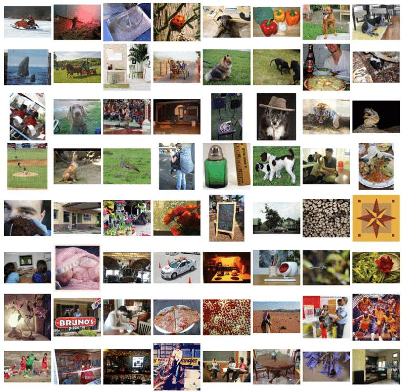
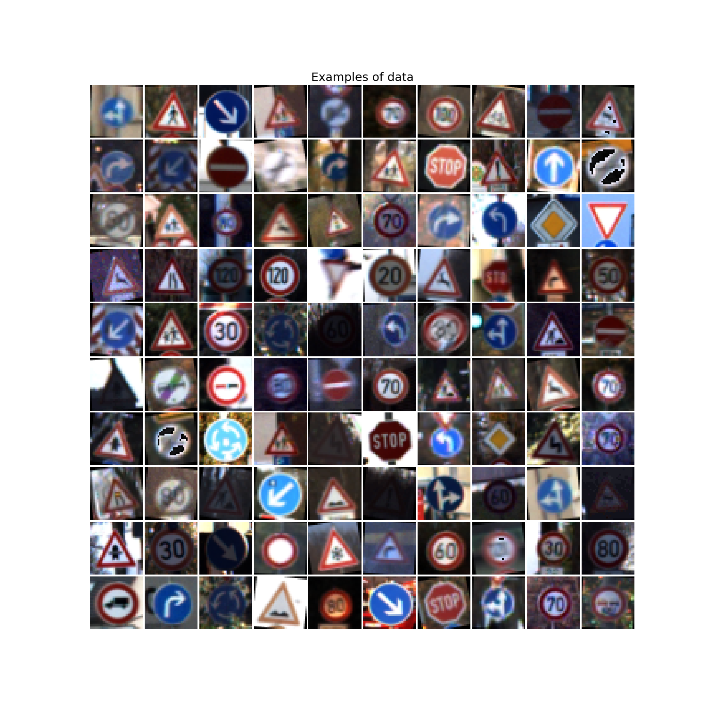
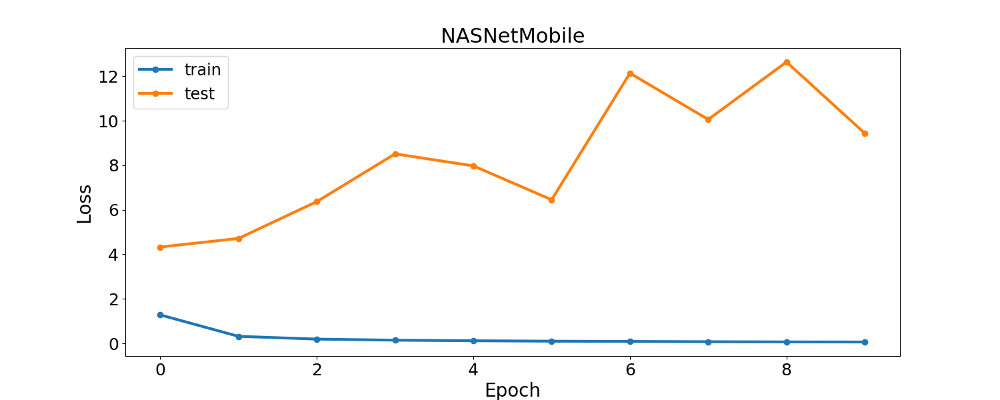
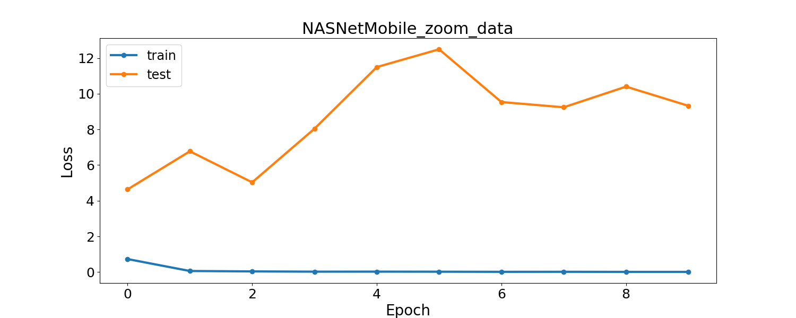
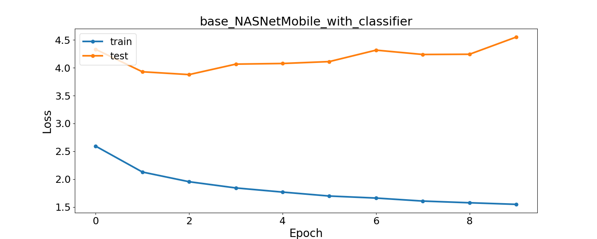
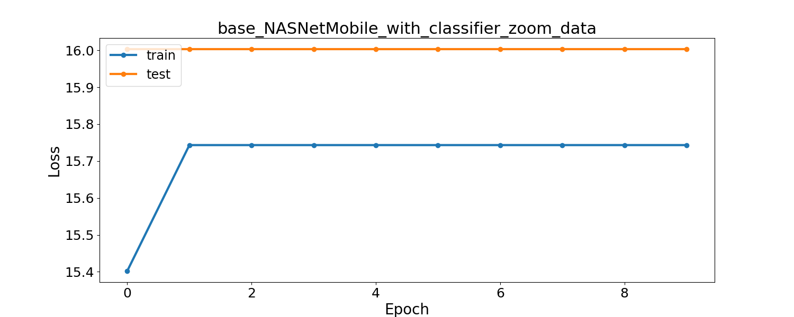
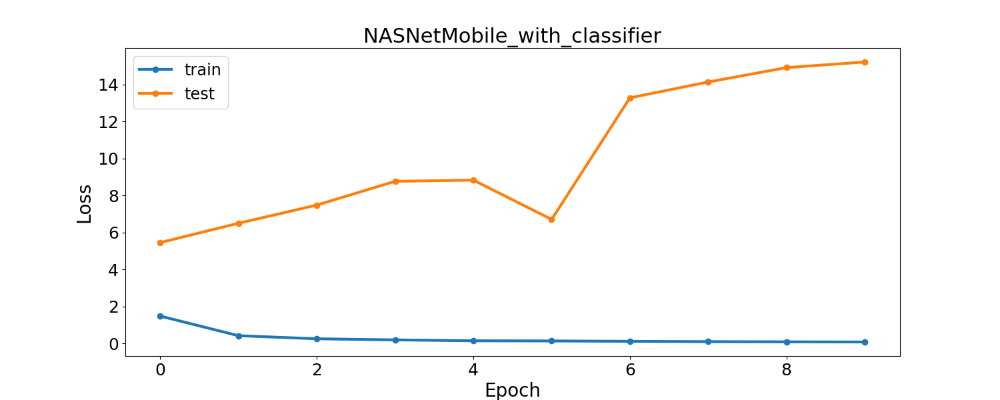
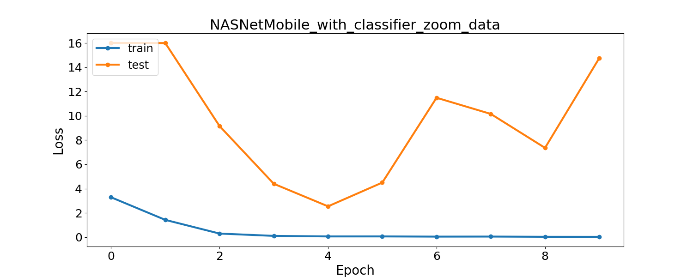

# Лабораторная работа №5
Необходимо реализовать несколько подходов к переносу обучения для решения текущей задачи распознавания дорожных знаков 
с использованием уже предобученной сети на похожей задаче.

# Исходная задача A
В качестве исходной задачи будем рассматривать задачу многоклассовой классификации на датасете ImageNet.

 

## NASNet
В качестве решения исходной задачи возьмем сеть NASNet, которая была обучена на датасете ImageNet.

Данная сеть принимает на вход цветное изображения размером от 32*32,
а на выходе определяет вероятность принадлежности объекта на изображении к одному из 1000 классов.

|Model|Size|Top-1 Accuracy|Top-5 Accuracy|Parameters|Depth|
|--- |--- |--- |--- |--- |--- |
|Xception|88 MB|0.790|0.945|22,910,480|126|
|VGG16|528 MB|0.713|0.901|138,357,544|23|
|VGG19|549 MB|0.713|0.900|143,667,240|26|
|ResNet50|98 MB|0.749|0.921|25,636,712|-|
|ResNet101|171 MB|0.764|0.928|44,707,176|-|
|ResNet152|232 MB|0.766|0.931|60,419,944|-|
|ResNet50V2|98 MB|0.760|0.930|25,613,800|-|
|ResNet101V2|171 MB|0.772|0.938|44,675,560|-|
|ResNet152V2|232 MB|0.780|0.942|60,380,648|-|
|InceptionV3|92 MB|0.779|0.937|23,851,784|159|
|InceptionResNetV2|215 MB|0.803|0.953|55,873,736|572|
|MobileNet|16 MB|0.704|0.895|4,253,864|88|
|MobileNetV2|14 MB|0.713|0.901|3,538,984|88|
|DenseNet121|33 MB|0.750|0.923|8,062,504|121|
|DenseNet169|57 MB|0.762|0.932|14,307,880|169|
|DenseNet201|80 MB|0.773|0.936|20,242,984|201|
|**NASNetMobile**|23 MB|0.744|0.919|5,326,716|-|
|NASNetLarge|343 MB|0.825|0.960|88,949,818|-|

Как видим, сеть NASNetMobile показывает достаточно хороший результат и обладает не очень большим числом параметров.

# Целевая задача B
По цветному изображению 32*32 необходимо определить какой из 43 дорожных знаков изображён на картинке.

 

# Перенос обучения

Предположим, что задачи А и B схожи, так как в обеих задачах ставится задача классификации и 
модели должны уметь хорошо выделять отличительные признаки классов.

Проведем несколько экспериментов по переносу обучения.

## Параметры

Были проведены эксперименты с разными данными.

Для работы с базовой сетью NASNet вектор меток был расширен с 43 до 1000.

Было сделано предположение, что с изображениями в более высоком разрешении NASNet будет работать лучше.
Для этого изображение на входе сети увеличивалось с 32 * 32 до 256 * 256 при помощи бикубической интерполяции.

|                       |    Base data         | Data + more labels        | Data + resize           | Data + more labels + resize | 
| :-------------------- | :------------------: | :-----------------------: | :---------------------: | :-------------------------: | 
| x_train               | (86989, (32, 32, 3)) |  (86989, (32, 32, 3))     | (86989, (256, 256, 3))  | (86989, (256, 256, 3))      |
| y_train               | (86989, 43)          |  (86989, 1000)            | (86989, 43)             | (86989, 1000)               |
| x_test                | (12630, (32, 32, 3)) |  (12630, (32, 32, 3))     | (12630, (256, 256, 3))  | (12630, (256, 256, 3))      |
| y_test                | (12630, 43)          |  (12630, 1000)            | (12630, 43)             | (12630, 1000)               |

loss = CrossEntropy 

loss = MeanSquaredError - для моделей с обучением без учителя

optimizer = Adam

learning_rate = 0.001

batch_size = 128

num_epochs = 10

## Прямое использование модели - перенос параметров

В этом эксперименте проверяется качество работы модели, построенной для решения исходной задачи A,
на данных целевой задачи B. Натренированная модель не изменяется: структура сохраняется, коррекция весов не осуществляется.

Сеть не обучается, используются готовые веса.

*base_NASNetMobile* - исходная модель, запускалась на данных с расширенным числом меток.

*base_NASNetMobile_zoom_data* - исходная модель, запускалась на данных с расширенным числом меток и увеличенным размером изображения.

|                 Model name                  | Test accuracy | Test loss | Train accuracy | Train loss | Time_train (s) |
| :------------------------------------------ | :-----------: | :-------: | :------------: | :--------: | :------------: |
| base_NASNetMobile                           |    0.0001     |  8.9801   |     0.0002     |   9.5025   |    28.2086     |
| base_NASNetMobile_zoom_data                 |      0.0      |  8.1943   |     0.0001     |   8.2727   |    77.7223     |

## Использование структуры модели - перенос знаний 
При реализации такой схемы предполагается, что модель, построенная для решения исходной задачи, обучается на данных,
подготовленных для решения целевой задачи. При этом веса модели инициализируются случайным образом.

Обучается вся сеть, но с исходной структурой.

*NASNetMobile* - исходная модель, запускалась на данных с расширенным числом меток.

*NASNetMobile_zoom_data* - исходная модель, запускалась на данных с расширенным числом меток и увеличенным размером изображения.

|                 Model name                  | Test accuracy | Test loss | Train accuracy | Train loss | Time_train (s) |
| :------------------------------------------ | :-----------: | :-------: | :------------: | :--------: | :------------: |
| NASNetMobile                                |    0.2848     |   10.435  |     0.9809     |   0.0613   |   1682.9806    |
| NASNetMobile_zoom_data                      |    0.3943     |  9.3234   |     0.9963      |  0.0125   |   10204.6502   |

|                            Loss                             |
| :---------------------------------------------------------- |
|           |
| |

## Извлечение признаков - перенос признакового описания
Удалим из глубокой модели классификатор и будем рассматривать начальную часть сети
как метод выделения признаков. При этом взамен старого классификатора можно создать
новый классификатор и обучить его на признаках, построенных с использованием начальной части
сети.

Обучается только классификатор, веса остальной сети не меняются.

*base_NASNetMobile_with_classifier* - исходная модель + классификатор.

*base_NASNetMobile_with_classifier_zoom_data* - исходная модель + классификатор, запускалась на данных с увеличенным размером изображения.

|                 Model name                  | Test accuracy | Test loss | Train accuracy | Train loss | Time_train (s) |
| :------------------------------------------ | :-----------: | :-------: | :------------: | :--------: | :------------: |
| base_NASNetMobile_with_classifier           |    0.0371     |  4.5505   |     0.5516     |   1.5534   |    234.5792    |
| base_NASNetMobile_with_classifier_zoom_data |    0.0071     |  16.0032  |     0.0233     |  15.7433   |    1807.578    |

|                            Loss                                                  |
| :------------------------------------------------------------------------------- |
|           |
| |

## Тонкая настройка модели - перенос на основе экземпляров
Предполагается, что последние слои глубокой модели, соответствующие классификатору, который решает исходную задачу,
заменяются новым классификатором и полученная модель обучается как единая система. 

Обучается вся сеть и новый классификатор.

*NASNetMobile_with_classifier* - исходная модель + классификатор.

*NASNetMobile_with_classifier_zoom_data* - исходная модель + классификатор, запускалась на данных с увеличенным размером изображения.

|                 Model name                  | Test accuracy | Test loss | Train accuracy | Train loss | Time_train (s) |
| :------------------------------------------ | :-----------: | :-------: | :------------: | :--------: | :------------: |
| NASNetMobile_with_classifier                |    0.0279     |  15.2123  |     0.9760     |   0.0872   |   1709.9733    |
| NASNetMobile_with_classifier_zoom_data      |    0.0574     |  14.7554  |     0.9806     |   0.0958   |   10318.4132   |

|                            Loss                                                  |
| :------------------------------------------------------------------------------- |
|           |
| |

## Общая таблица

[comment]: # (result_table_start)

|                 Model name                  | Test accuracy | Test loss | Train accuracy | Train loss | Time_train (s) |
| :------------------------------------------ | :-----------: | :-------: | :------------: | :--------: | :------------: |
| CNN_10_relu                                 |    0.9481     |  0.3136   |     0.999      |   0.0033   |   2071.7088    |
| base_NASNetMobile                           |    0.0001     |  8.9801   |     0.0002     |   9.5025   |    28.2086     |
| base_NASNetMobile_zoom_data                 |      0.0      |  8.1943   |     0.0001     |   8.2727   |    77.7223     |
| NASNetMobile                                |    0.2848     |   10.435  |     0.9809     |   0.0613   |   1682.9806    |
| NASNetMobile_zoom_data                      |    0.3943     |  9.3234   |     0.9963      |  0.0125   |   10204.6502   |
| base_NASNetMobile_with_classifier           |    0.0371     |  4.5505   |     0.5516     |   1.5534   |    234.5792    |
| base_NASNetMobile_with_classifier_zoom_data |    0.0071     |  16.0032  |     0.0233     |  15.7433   |    1807.578    |
| NASNetMobile_with_classifier                |    0.0279     |  15.2123  |     0.9760     |   0.0872   |   1709.9733    |
| NASNetMobile_with_classifier_zoom_data      |    0.0574     |  14.7554  |     0.9806     |   0.0958   |   10318.4132   |

[comment]: # (result_table_end)

# Выводы

Перенос обучения не показал значительного улучшения.
Скорее всего, задачи были слишком разные или для такой сложной модели целевая задача слишком простая.
В процессе обучения модели показывали точность на тестовой выборке до 0.6, но после переобучались и точность заметно снижалась.

Наша модель CNN_10_relu демонстрировала точность до 0.94.
