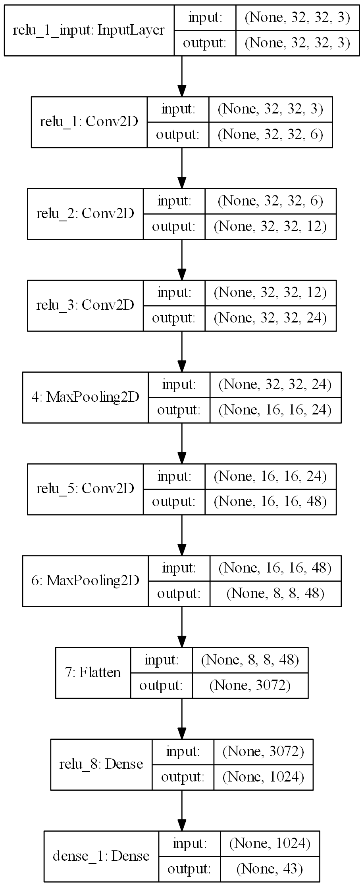

# Лабораторная работа №5

# Выбранные модели

## CNN_10_relu

|         Model name          |                     Model graph                      |
| :-------------------------- | :--------------------------------------------------- |
| CNN_10_relu                 |    |

|                            Accuracy                             |                            Loss                             |
| :-------------------------------------------------------------- | :---------------------------------------------------------- |
|    |    |

|      Model name       | Test accuracy | Test loss | Train accuracy | Train loss | Time_train (s) |
| :-------------------- | :-----------: | :-------: | :------------: | :--------: | :------------: |
| CNN_10_relu           |    0.9481     |  0.3136   |     0.999      |   0.0033   |   2071.7088    |

# Численные эксперименты
## Параметры
x_train = (86989, (32, 32, 3))

y_train = (86989, 43)

x_test = (12630, (32, 32, 3)) 

y_test = (12630, 43)

loss = CrossEntropy 

loss = MeanSquaredError - для моделей с обучением без учителя

optimizer = Adam

learning_rate = 0.001

batch_size = 128

num_epochs = 10

[comment]: # (result_table_start)

|      Model name       | Test accuracy | Test loss | Train accuracy | Train loss | Time_train (s) |
| :-------------------- | :-----------: | :-------: | :------------: | :--------: | :------------: |
| del                   |    0.8823     |  0.7741   |     0.9941     |   0.0216   |    781.0184    |
| base_NASNetMobile_512 |      0.0      |  4.9841   |      0.05      |   4.968    |    49.3679     |

[comment]: # (result_table_end)

## Анализ
