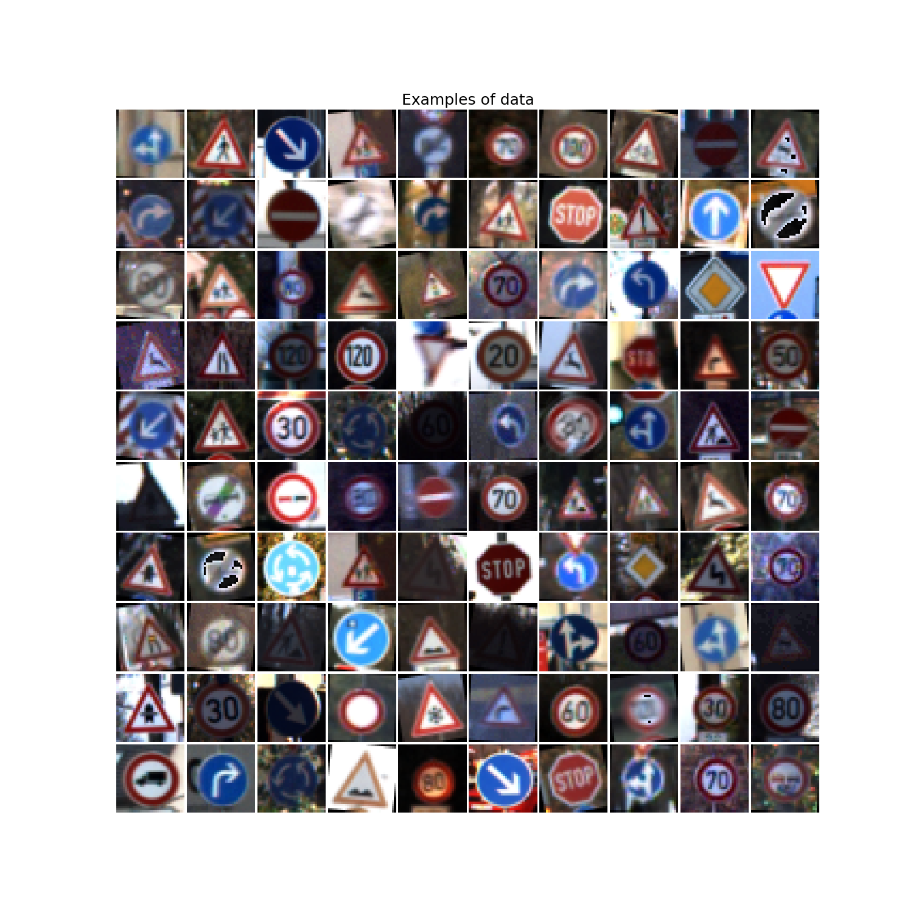
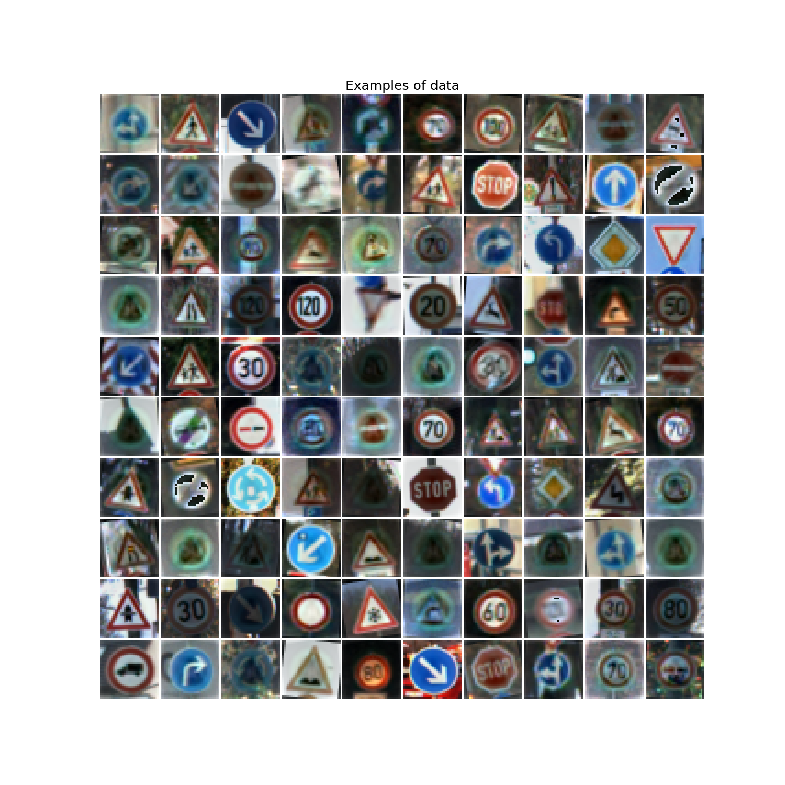

# Лабораторные работы по курсу "Глубокое обучение"
В рамках лабораторных работ будут реализованы разные конфигурации
нейронных сетей для решения задачи классификации.

## Постановка задачи
По входным данным *X* вычислить выход сети *U*. Задача обучения сети заключается
в минимизации функции ошибки *E(U,Y)*, где *Y* - ожидаемый выход сети.

В нашем случае в качестве функции ошибки выступает кросс-энтропия:

=\sum\limits_{j=1}^My_j\ln{u_j})

## Данные
Источник данных: [Traffic Signs Preprocessed](https://www.kaggle.com/valentynsichkar/traffic-signs-preprocessed)

Данные лежат в формате .pickle в виде словаря с ключами: y_train, x_train, y_test, x_test.

Необходимо распознать на RGB изображении 32 * 32 один из 43 дорожных знаков.

|          |  Число примеров |
|  ------- | --------------- |
| x_train  | 86989           |
| x_test   | 12630           |

В обучающей выборке содержится 86989 примеров.
В тестирующей выборке содержится 12630 примеров.

На каждый класс приходится около 2000 примеров в обучающей выборке.

Пример данных для обучения:

### Предобработка данных
Предобработка данных заключается в нормализации и вычитании "среднего изображения".

Пример данных для обучения после предобработки:

Для использования в FCNN данные представляются в виде вектора, размерность которого есть 32 * 32 * 3 = 3072.
Для CNN в виде набора матриц (32, 32, 3)

## Математическая модель нейрона
Математическая модель нейрона имеет следующий вид:

)

Где  - функция активации,  -
смещение,  - вес,  - вход.

Для удобства выкладок сделаем некоторое преобразование. Внесем смещение в сумму с новым значением синапса .
Тогда модель нейрона можно записать в следующем виде:

)

## Функции активации
### На скрытом слое
На скрытых слоях будем использовать следующие функции:

| Функции активации                                                                  |
| :--------------------------------------------------------------------------------- |
|    |
|    |
|    | 

### На выходном слое
На выходе будем использовать функцию Softmax:

## Функция ошибки
В качестве функции ошибки рассмотрим кросс-энтропию:

=\sum\limits_{j=1}^My_j\ln{u_j})

Где *y* - выход сети, *u* - ожидаемый выход, *M* - число нейронов на выходном слое.

## Метрика качества

Наши данные являются сбалансированными, то есть каждому классу соответствует одинаковое число примеров в обучающей выборке.
Следовательно, мы можем использовать метрику accuracy:

&space;=&space;U_i])

Где *Y* - выход сети,  *X* - вход сети, *U* - ожидаемый выход.

То есть метрика качества - доля правильно классифицированных объектов из выборки.

## Обучение на тренировочной выборке
Сеть обучается заданное число эпох. Эпоха - полный проход по тестовой выборке.
Внутри эпохи набор тестовых данных делится на пакеты.

* Инициализация весов
* Каждую эпоху
    * Перемешиваем выборку
    * Делим выборку на пакеты и для каждого пакета
        * Коррекция весов по алгоритму обратного распространения
        
## Описание реализации
### Внешние зависимости
tensorflow - основа для Keras

keras - фреймворк для работы с сетями

numpy - для работы с векторами и матрицами

pickle - для работы с изображениями

math - для математических вычислений

matplotlib - для визуализации

pydot, graphviz - для визуализации графа сети

datetime - для замера времени работы

json - для хранения статистки

re - для регулярных выражений

os - для работы с файловой системой
